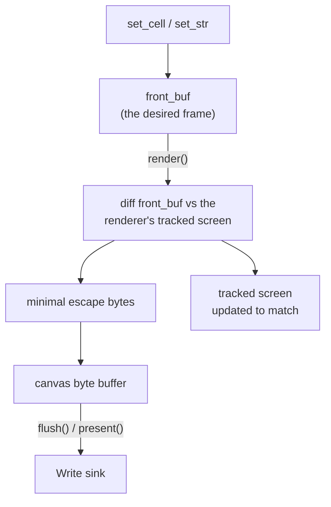

`Canvas<W>` is a cell grid plus the diffing renderer over any `std::io::Write`
sink. The sink can be a terminal output handle, a `Vec<u8>`, a buffered writer,
or a socket. `Canvas` has no input decoder and no raw-mode lifecycle opinion;
`Screen` composes it with `Terminal` and `EventSource` when you want the full
application facade.

See the [Canvas rustdoc](/api/uncurses/canvas/struct.Canvas.html) for the full
API, [the Screen facade]() for lifecycle management,
and the [`offscreen` example](#draw-only) for
rendering without a terminal.

## The rendering boundary

Drawing APIs mutate the desired cell grid. Rendering turns changed cells into
escape bytes, and flushing sends those bytes to the writer.



The three frame methods have distinct responsibilities:

| Method | Responsibility |
| --- | --- |
| `render()` | Computes the frame diff and stages escape bytes in the canvas byte buffer. It is infallible because it writes only to memory. |
| `flush()` | Drains staged bytes, including raw bytes written through `Canvas`'s `Write` implementation, into the underlying writer and flushes that writer. It returns `io::Result<()>`. |
| `present()` | Convenience method for `render()` followed by `flush()`. |

```rust
use std::io::Write;
use uncurses::canvas::Canvas;
use uncurses::style::Style;
use uncurses::text::TextSurface;

fn main() -> std::io::Result<()> {
    let mut canvas: Canvas<Vec<u8>> = Canvas::new(Vec::new(), (20, 3));

    canvas.set_str((0, 0), "hello", Style::default());
    canvas.render();
    canvas.flush()?;

    let bytes = canvas.writer();
    assert!(!bytes.is_empty());
    Ok(())
}
```

## Cells in, escape bytes out

The front buffer is the desired frame. `set_cell`, `set_str`, and the surface
mutation APIs mark touched spans in that grid. On `render()`, touched desired
cells are copied into the renderer's staging buffer only when their `Cell`
values differ from the previously staged value.

The renderer then diffs that staging buffer against its tracked model of what is
currently on the terminal. Only changed cells emit bytes. Rewriting the same
value is filtered by equality before terminal bytes are planned, so repeated
draw calls are cheap when the frame is unchanged.

At frame time, the renderer also plans cursor movement and style changes. It
tracks the active pen, cursor position, and screen buffer state so a cell diff
can emit only the necessary SGR, OSC 8 hyperlink, cursor, and glyph bytes.

## Managed area

`Canvas` supports the same two layouts exposed by `Screen`:

- inline mode, the default, manages a full-width rectangle anchored at the
  current terminal cursor and uses relative cursor movement;
- alternate-screen mode manages the whole viewport and can use absolute cursor
  movement.

Call `resize(width, height)` to set the managed area. In fullscreen, pass the
terminal viewport size. Inline canvases usually pass the terminal width and the
application's chosen height.

## Optimizations

`Optimizations` is the renderer's contract for which byte sequences are safe to
emit. Disabling a flag does not change the intended cell result; it makes the
renderer choose more conservative bytes.

| Flag | Enables |
| --- | --- |
| `ECH` | Erase Characters, `CSI Ps X`, for clearing runs on a row. |
| `REP` | Repeat preceding character, `CSI Ps b`, for compact repeated ASCII glyphs. |
| `ICH` / `DCH` | Insert and delete cells within a row. |
| `CSR`, `SU_SD`, `IL_DL` | Scroll regions, scroll up/down, and insert/delete-line scroll fallbacks. |
| `BCE` | Background Color Erase, where erase operations paint with the active background color. |
| `CHA`, `HPA`, `VPA` | Absolute horizontal and vertical cursor addressing. |
| `TABS`, `CBT`, `CHT` | Hardware tabs and cursor backward/forward tab movement. |
| `BS` | Literal backspace as cursor-left-by-one. |
| `ONLCR` | The line discipline maps `\n` to `\r\n`; normally unset for raw-mode apps. |

The active set gates cursor and diff planning. For example, `CHT`, `TABS`, and
`BS` determine whether horizontal movement may use forward tabs, literal tab
bytes, or backspace; `CHA`, `HPA`, and `VPA` determine whether absolute moves
may compete with relative moves.

`Canvas::new` detects optimizations from the process environment. Use
`Canvas::from_env` when detection should use another `Env`, or configure the
renderer directly with `with_optimizations` / `use_optimizations`.
`Optimizations::from_term` maps known `$TERM` families to conservative baselines
and falls back to `Optimizations::none()` for unknown, empty, or `dumb` terms.

## Offscreen rendering

Because the writer is generic, a canvas can render without touching a terminal:

```rust
use std::io::Write;
use uncurses::canvas::Canvas;

fn main() -> std::io::Result<()> {
    let mut canvas: Canvas<Vec<u8>> = Canvas::new(Vec::new(), (46, 9));

    // Draw cells here.
    canvas.present()?;

    let frame: &[u8] = canvas.writer();
    assert!(!frame.is_empty());
    Ok(())
}
```

`writer()` holds the exact bytes flushed to the underlying sink. The
`offscreen` example uses this to render a styled card into `Vec<u8>`, then
replays those bytes to stdout. This is the same mechanism used for snapshots,
transcripts, or shipping rendered frames over a socket.
