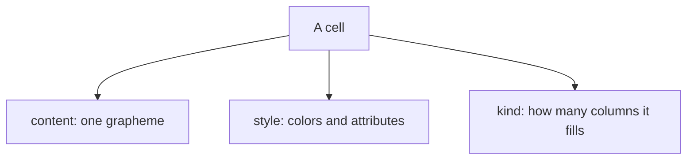

A terminal screen is not a canvas of free pixels. It is a grid of fixed slots,
each one character tall and (usually) one character wide. uncurses calls one
slot a *cell*, and the cell is the atomic unit of everything you draw.

## What a cell holds

Every cell carries three things: the bit of text to show, how it should look,
and how many columns it takes up.



The content is a single *grapheme*, which is "one character" the way a human
counts them, even when it is several Unicode code points stitched together
(think `e` plus a combining accent, or a flag). The style is color and
attributes like bold or underline. The kind is the interesting part.

## Narrow, wide, and continuation

Most cells are *narrow*: one grapheme, one column. But some graphemes are
double width. A CJK character like `世` wants two columns, not one. uncurses
models that as a *wide* primary cell followed by a *continuation* placeholder
that holds the second column. The continuation has no content of its own and
reports a width of zero, because its column belongs to the wide cell on its
left.

<figure class="term-fig"><div class="term-grid" style="grid-template-columns: auto repeat(3, 2.2rem);"><span class="lbl">col:</span><span class="lbl">1</span><span class="lbl">2</span><span class="lbl">3</span><span class="lbl">row 1</span><span>世</span><span class="cont">cont</span><span>A</span></div><figcaption>One terminal row. The wide glyph <code>世</code> is a primary cell in column 1 with a zero-width continuation cell in column 2; the narrow <code>A</code> sits in column 3.</figcaption></figure>

The wide `世` is a primary cell plus a *continuation* cell, two separate cells
the grid keeps side by side. The continuation carries no content and reports
width 0, because its column belongs to `世` on its left. You almost never
create a continuation by hand: writing a wide grapheme into a grid lays down the
primary and its continuation together, as a pair. The
[Width]() page digs into how uncurses decides what is
narrow and what is wide, and why getting it wrong smears a whole row.

## The blank cell

What does an empty spot on the terminal, a slot showing nothing at all, equal?
A *blank* cell: a single space painted in the default style. `Cell::BLANK` is
uncurses's name for exactly that. It is what a freshly allocated grid is full
of, and what clearing a cell puts back.

## Building a cell

Construct cells with `narrow` and `wide`, attach a style fluently (colors,
attributes, even an OSC 8 hyperlink), and ask for the width the grid will
reserve:

```rust
use uncurses::cell::Cell;
use uncurses::color::BasicColor;
use uncurses::style::Style;

fn main() {
    let cell = Cell::narrow("a").style(
        Style::default()
            .bold()
            .fg(BasicColor::Green)
            .link("https://example.com", ""),
    );
    assert_eq!(cell.width(), 1);

    let wide = Cell::wide("世");
    assert_eq!(wide.width(), 2);
}
```

A single cell is not very useful on its own. The next step is a whole grid of
them: see [Buffers]().
