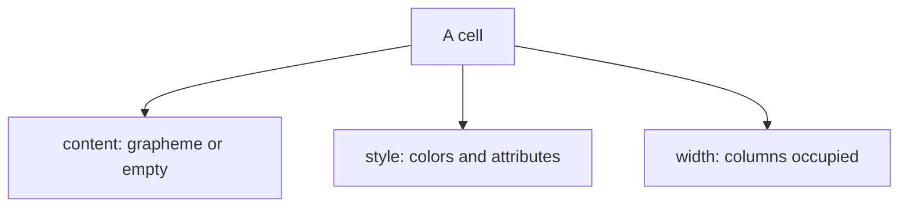

A terminal screen is not a canvas of free pixels. It is a grid of fixed slots,
each one character tall and (usually) one character wide. uncurses calls one
slot a *cell*, and the cell is the atomic unit of everything you draw.

## What a cell holds

Every cell carries three things: the grapheme to show (if any), how it should
look, and how many columns it occupies.


```mermaid
flowchart TB
  cell["A cell"] --> txt["content: grapheme or empty"]
  cell --> look["style: colors and attributes"]
  cell --> cols["width: columns occupied"]
```

For visible cells, the content is a single *grapheme*. That means "one
character" the way a human counts it, even when it is several Unicode code
points stitched together (think `e` plus a combining accent, or a flag emoji).
The style is color and attributes like bold or underline. The width is the
interesting part.

## Narrow, wide, and continuation

Most cells are *narrow*: one grapheme, one column. Some graphemes are wider. A
CJK character like `世` wants two columns, not one. uncurses models that as a
*primary* cell holding the grapheme, followed by a *continuation* placeholder
for each further column. A continuation has no content of its own and reports
width zero, because its column belongs to the primary on its left.

A cell can be wider than two columns. On a terminal that measures text the
older way, a joined emoji sequence such as a family emoji draws each face in
turn, so it occupies eight columns and owns seven continuations. The
[Width]() page explains when that happens.

| row / col | 1 | 2 | 3 |
| --- | --- | --- | --- |
| row 1 | 世 | cont | A |

One terminal row. The wide glyph `世` is a primary cell in column 1 with a
zero-width continuation cell in column 2, and the narrow `A` sits in column 3.

The grid keeps the wide `世` and its *continuation* side by side as two cells.
You almost never create a continuation by hand: writing a wide grapheme into a
grid lays down the primary and its continuations together. The
[Width]() page digs into how uncurses decides what is
narrow and what is wide, and why getting it wrong smears a whole row.

## The blank cell

What is an empty terminal slot, a place showing nothing at all? A *blank* cell:
a single space painted in the default style. uncurses calls that `Cell::BLANK`.
It is what a freshly allocated grid is full of, and what clearing a cell puts
back.

## Building a cell

Construct every cell with `Cell::new`, passing the content and the number of
columns it occupies. Attach a style fluently (colors, attributes, even an OSC 8
hyperlink), and ask how many columns the grid will reserve:

```rust
use uncurses::cell::Cell;
use uncurses::color::Color;
use uncurses::style::Style;

fn main() {
    let cell = Cell::new("a", 1).style(
        Style::default()
            .bold()
            .fg(Color::Green)
            .link("https://example.com", ""),
    );
    assert_eq!(cell.width(), 1);

    let wide = Cell::new("世", 2);
    assert_eq!(wide.width(), 2);
}
```

Measure the width rather than guessing it: `WidthMode::grapheme_width` gives
the number the terminal will advance, and passing that keeps the grid and the
screen in agreement.

A single cell is not very useful on its own. The next step is a whole grid of
them: see [Buffers]().
