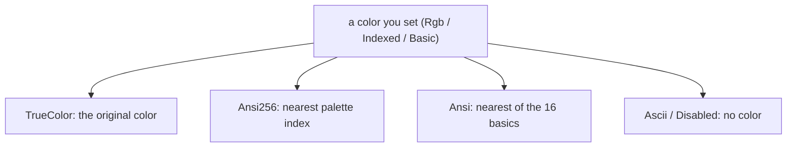

Color is part of a cell's [style](). You set the color
you want at full fidelity, and uncurses adapts it to what the terminal in front
of you can actually display. You never branch on terminal capability; you state
your intent, and the library does the downsampling.

## Three depths

A `Color` has three representations, and you mix them freely:

| Kind | Range | Example |
| --- | --- | --- |
| `Color::Basic` | the 16 named ANSI colors | `BasicColor::Green` |
| `Color::Indexed` | the 256-color xterm palette | `Color::Indexed(208)` |
| `Color::Rgb` | 24-bit true color | `Color::Rgb(255, 105, 180)` |

All three convert to RGB with `to_rgb`, so palette colors work with the true-color
helpers. `Color::hex` parses `#rgb`, `#rrggbb`, or `#rrggbbaa` (alpha is ignored,
terminals have none), and `Color::hsl` builds a color from hue, saturation, and
lightness.

## Profiles and downsampling

A [`Profile`] is the color capability of an output stream. There are five, ordered
from least to most capable:

```
Disabled  <  Ascii  <  Ansi  <  Ansi256  <  TrueColor
```

When a frame is rendered, every color is mapped through the active profile to the
best thing that profile can emit. You always specify the color you mean; the
profile decides how it comes out.



`Ascii` drops color but keeps attributes like bold and underline; `Disabled`
drops styling entirely. That is the difference between a frame that is monochrome
but still has structure, and one that is plain text.

## Detection is automatic

A `Screen` picks its profile for you at `init`. It starts from the environment,
the same way other CLI tools decide whether to emit color, then probes the
terminal once for direct-color support and upgrades to `TrueColor` if it gets a
confirmation (you can suppress that probe with `query_capabilities: false`). The
environment conventions it reads:

- Output that is not a TTY is `Disabled`, unless `TTY_FORCE` or `CLICOLOR_FORCE`.
- `NO_COLOR` clamps to `Ascii`: no color, but decoration may remain.
- `COLORTERM=truecolor` (or `24bit`) upgrades to `TrueColor`.
- `TERM=dumb` is `Disabled`; `*-256color` is `Ansi256`; `*-direct` is `TrueColor`.
- `CLICOLOR` and `CLICOLOR_FORCE` raise a terminal to at least `Ansi`.

Read the result with `screen.color_profile()`, and override it with
`screen.use_color_profile(..)` when you want to force a level regardless of the
environment.

## Choosing a profile yourself

Off the screen, the [`Encode`](/api/uncurses/text/trait.Encode.html) trait's `*_with`
variants take a profile directly, so the same painted [buffer]() can produce full-color escapes for the terminal and plain text
for a snapshot test:

```rust
let colored = frame.display().to_string();              // TrueColor by default
let plain = frame.display_with(Profile::Disabled).to_string(); // no escapes
```

This is the basis of the [offscreen rendering]() guide: compose once, emit at whatever
color level the destination needs.
