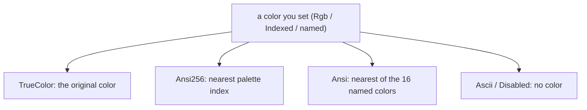

Color is part of a cell's [style](). You set the color
you want at full fidelity, and uncurses adapts it to what the terminal in front
of you can actually display. You never branch on terminal capability; you state
your intent, and the library does the downsampling.

## Three depths

A `Color` has three representations, and you mix them freely:

| Kind | Range | Example |
| --- | --- | --- |
| named | the 16 named ANSI colors | `Color::Green`, `Color::BrightBlue` |
| `Color::Indexed` | the 256-color xterm palette | `Color::Indexed(208)` |
| `Color::Rgb` | 24-bit true color | `Color::Rgb(255, 105, 180)` |

All three convert to RGB with `to_rgb`, so palette colors work with the true-color
helpers. `Color::hex` parses `rgb`, `rrggbb`, or `rrggbbaa`, with or without a
leading `#` (alpha is ignored, terminals have none), and `Color::hsl` builds a
color from hue, saturation, and lightness.

## Profiles and downsampling

A [`Profile`](/api/uncurses/color/enum.Profile.html) is the color capability of
an output stream. There are five, ordered from least to most capable:

```
Disabled  <  Ascii  <  Ansi  <  Ansi256  <  TrueColor
```

When a frame is rendered, every color is mapped through the active profile to the
best thing that profile can emit. You always specify the color you mean; the
profile decides how it comes out.



`Ascii` drops color but keeps attributes like bold and underline; `Disabled`
drops styling entirely. That is the difference between a frame that is monochrome
but still has structure, and one that is plain text.

## Detection follows your reads

A [`Program`]() picks an initial profile when you
call `init`. It starts from the environment, the same way other CLI tools decide
whether to emit color. `init` never probes the terminal on its own, so that
first answer is environment-only.

To go further, ask for it:
[`program.query_capabilities(&[])?`](/api/uncurses/program/struct.Program.html#method.query_capabilities)
sends the query set, which includes the XTGETTCAP probe for direct color. The
upgrade to `TrueColor` happens when the reply comes back through your read loop,
since [`read_event`](/api/uncurses/program/struct.Program.html#method.read_event)
records capabilities as it goes. Never call `query_capabilities` and nothing is
sent. The environment conventions the initial guess reads:

- Output that is not a TTY is `Disabled`, unless `TTY_FORCE` makes it follow TTY
  rules or `CLICOLOR_FORCE` forces color.
- On a TTY, `NO_COLOR` clamps to `Ascii`: no color, but decoration may remain.
- `COLORTERM=truecolor`, `24bit`, `yes`, or `true` upgrades to `TrueColor`,
  except inside `screen`.
- `TERM=dumb` is `Disabled`; `*-256color`, `tmux*`, and `screen*` are `Ansi256`;
  `*-direct` and known true-color terminal names are `TrueColor`.
- `CLICOLOR` raises a non-dumb TTY to at least `Ansi`; `CLICOLOR_FORCE` raises any
  output to at least `Ansi`.

The profile is a render property, so it lives on the screen: read it with
`program.screen().color_profile()` and override it with
`program.screen_mut().set_color_profile(..)` when you want to force a level
regardless of the environment. `set_color_profile` cannot fail and writes
nothing; it only changes how the next frame is encoded.


`Program`'s own reads record capabilities for you, so a normal
`read_event` loop picks up the direct-color reply with no extra work. Feeding
events through
[`observe_event`](/api/uncurses/program/struct.Program.html#method.observe_event)
by hand is only needed when the events reach you some other way, such as the
ratatui `UncursesBackend`, whose reads stay pure.


## Choosing a profile yourself

When you are not using a `Screen`, the
[`Encode`](/api/uncurses/text/trait.Encode.html) trait's `*_with` variants take a
profile directly, so the same painted [buffer]() can
produce full-color escapes for the terminal and plain text for a snapshot test:

```rust
use uncurses::buffer::TextBuffer;
use uncurses::color::{Color, Profile};
use uncurses::style::Style;
use uncurses::text::{Encode, TextSurface};

let mut buffer = TextBuffer::new(6, 1);
buffer.set_str((0, 0), "hello", Style::new().fg(Color::Green));

let colored = buffer.display().to_string(); // TrueColor by default
let plain = buffer.display_with(Profile::Disabled).to_string(); // no escapes
```

This is the basis of the [offscreen rendering]() guide: compose once, emit at whatever
color level the destination needs.
