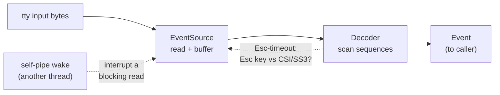
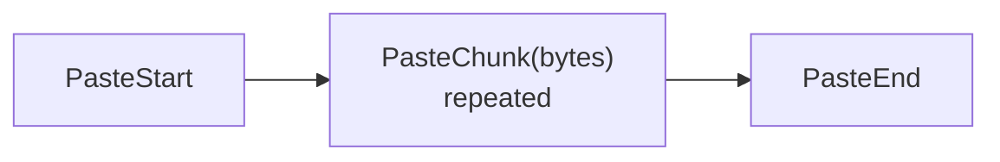

`EventSource<I>` is the low-level input side of uncurses. It reads raw terminal
bytes, buffers incomplete control sequences, and yields typed `Event` values for
keys, mouse input, bracketed paste, focus, resize, and terminal replies.

See the [event rustdoc](../api/uncurses/event/) for the full API, and
[the Screen facade]() for the higher-level wrapper
that observes capability replies while you read events.

## The decode pipeline

Input arrives as a byte stream. `EventSource` owns the input handle and the
pending-byte buffer; the `Decoder` scans complete sequences and returns one
`Event` at a time.



The decoder accepts both 7-bit escape forms and 8-bit C1 introducers: for
example CSI can start with `ESC [` or `0x9B`, OSC with `ESC ]` or `0x9D`, and
DCS with `ESC P` or `0x90`. String controls end with `ESC \` or `0x9C`; OSC also
accepts BEL.

Partial sequences are not guessed immediately. If a read ends after `ESC`, a
CSI prefix, an OSC payload, a DCS payload, or an incomplete UTF-8 scalar, the
bytes stay buffered until more input arrives. The one time policy enters the
picture is the Escape key ambiguity: `EventSource` waits for the configured
`esc_timeout` before deciding that a lone `ESC` is a `KeyPress(Escape)` rather
than the start of CSI, SS3, or an Alt-modified key.

During bracketed paste, escape-timeout disambiguation is suspended and bytes are
streamed as paste chunks until the 7-bit paste terminator arrives.

## EventSource

Use `EventSource::new(input)` over a raw terminal input half. The main methods
are:

| Method | Behavior |
| --- | --- |
| `read()` | Block until the next decoded `Event`. |
| `poll(timeout)` | Perform I/O and wait up to `timeout` for an event. Internal ESC and paste deadlines can shorten the wait. |
| `try_read()` | Pop an already queued event without doing I/O. |
| `unread(event)` | Push an event back to the front of the queue, useful when waiting for a specific reply. |
| `with_esc_timeout(timeout)` | Change the Esc-key-vs-sequence disambiguation window. |
| `with_paste_idle_timeout(timeout)` | Change or disable the safety timeout for an unterminated paste. |

```rust
use uncurses::event::{Event, EventSource, Key};
use uncurses::terminal::Terminal;

fn main() -> std::io::Result<()> {
    let mut term = Terminal::stdio();
    term.make_raw()?;
    let mut events = EventSource::new(term.input())?;

    let q: Key = "ctrl+c".parse().unwrap();
    loop {
        match events.read()? {
            Event::KeyPress(ref key) if *key == q => break,
            Event::Resize(ws) => {
                let _ = (ws.col, ws.row);
            }
            _ => {}
        }
    }

    term.restore()
}
```

## The Event enum

`Event` is a plain enum. This table groups the variants most applications match
on; use [the rustdoc](../api/uncurses/event/enum.Event.html) for the complete
list.

| Category | Main variants | Notes |
| --- | --- | --- |
| Keyboard | `KeyPress(Key)`, `KeyRepeat(Key)`, `KeyRelease(Key)` | Repeat/release come from richer keyboard protocols such as Kitty. |
| Mouse | `MouseClick(Mouse)`, `MouseRelease(Mouse)`, `MouseWheel(Mouse)`, `MouseMove(Mouse)` | Carry coordinates, button/wheel direction, and key modifiers. |
| Paste | `PasteStart`, `PasteChunk(Vec<u8>)`, `PasteEnd` | Paste content is bytes, not guaranteed UTF-8. |
| Size and geometry | `Resize(Winsize)`, `WindowCellSize`, `WindowPixelSize`, `CellPixelSize` | `Resize` carries `col`, `row`, `xpixel`, and `ypixel`; explicit size-query replies use the other variants. |
| Focus | `FocusIn`, `FocusOut` | Emitted when focus reporting mode is enabled, or from Windows console focus records. |
| Query replies | `CursorPosition`, `PrimaryDeviceAttributes`, `SecondaryDeviceAttributes`, `TertiaryDeviceAttributes`, `TerminalName`, `ModeReport`, `ModifyOtherKeys`, `KittyKeyboardEnhancements`, `ForegroundColor`, `BackgroundColor`, `CursorColor`, `PaletteColor`, `ColorTheme`, `Clipboard`, `Termcap` | Terminal replies arrive through the same stream as user input. |
| Unknown | `UnknownCsi`, `UnknownOsc`, `UnknownDcs`, and related variants | Complete but unrecognized framed input is preserved instead of silently discarded. |

## Keys

A key event carries a `Key`: a `KeyCode`, a `KeyModifiers` bitset, and optional
text metadata from richer protocols. `KeyCode` covers characters, named keys,
function keys, keypad keys, media keys, and modifier-key identities.

`Key` implements `FromStr` for binding strings:

```rust
use uncurses::event::Key;

let quit: Key = "ctrl+c".parse().unwrap();
let enter: Key = "enter".parse().unwrap();
let q: Key = "q".parse().unwrap();
```

Parsing accepts modifier names such as `ctrl`, `alt`, `shift`, `super`, `hyper`,
and `meta`, plus key names such as `enter`, `esc`, `space`, `tab`, arrows, and
`f1` through `f35`.

Matching is ordinary equality:

```rust
use uncurses::event::{Event, Key};

let quit: Key = "ctrl+c".parse().unwrap();

if let Event::KeyPress(ref key) = event {
    if *key == quit {
        // quit
    }
}
```

That works because `Key` equality and hashing use only the canonical chord:
`KeyCode` plus binding modifiers. Optional `text`, shifted/base glyph metadata,
and lock-state bits such as Caps Lock are ignored for equality.

## Mouse

Mouse events carry a `Mouse` payload:

```rust
pub struct Mouse {
    pub x: u16,
    pub y: u16,
    pub button: MouseButton,
    pub modifiers: KeyModifiers,
}
```

Enable mouse tracking through `ScreenOptions` at initialization, or later with
`Screen::enable_mouse(motion, pixels)`. `motion` asks for movement reports;
`pixels` asks for SGR-pixel coordinates when the terminal reports that it can
support them.

```rust
use uncurses::screen::{MousePreference, ScreenOptions};

let options = ScreenOptions {
    mouse: Some(MousePreference {
        motion: true,
        pixels: true,
    }),
    ..ScreenOptions::default()
};
```

The decoder accepts SGR mouse mode, SGR-pixel mode, X10, UTF-8 mouse mode, and
URxvt decimal mouse mode. SGR and SGR-pixel have the same wire shape, so the
decoder cannot distinguish them from bytes alone. If mode 1016 is active,
`Mouse::x` and `Mouse::y` are pixel offsets; call `mouse_pixel_to_cell` when you
need cell coordinates:

```rust
use uncurses::event::{Mouse, mouse_pixel_to_cell};

let cell: Mouse = mouse_pixel_to_cell(mouse, pixel_width, pixel_height, cols, rows);
```

See the [mouse input guide]() for a
full loop.

## Paste

With bracketed paste enabled, pasted content arrives as:



`ScreenOptions::default()` enables bracketed paste, and `Screen` also exposes
`enable_bracketed_paste()` / `disable_bracketed_paste()`. Reassemble a paste by
collecting bytes between `PasteStart` and `PasteEnd`; decode to text only after
you decide how to handle invalid UTF-8.

See the [paste guide]().

## Resize and focus

`Resize(Winsize)` reports terminal-size changes. `Winsize::col` and
`Winsize::row` are the cell dimensions; `xpixel` and `ypixel` are pixel
dimensions when the platform or in-band report provides them, otherwise `0`.

Focus reports use DEC private mode 1004. Enable them with
`Screen::enable_focus_events()` and match `Event::FocusIn` /
`Event::FocusOut`.

## Terminal queries

Queries are request bytes written to the output side. Replies are decoded back
as ordinary `Event` values on the input side, so a loop can preserve unrelated
keystrokes with `unread` instead of swallowing them.

```rust
use std::io::Write;

use uncurses::ansi::background::REQUEST_BACKGROUND_COLOR;
use uncurses::ansi::ctrl::REQUEST_PRIMARY_DA;
use uncurses::ansi::status::write_request_cursor_position;
use uncurses::event::{Event, EventSource};
use uncurses::terminal::Terminal;

fn main() -> std::io::Result<()> {
    let mut term = Terminal::stdio();
    term.make_raw()?;
    let mut out = term.output();
    let mut events = EventSource::new(term.input())?;

    out.write_all(REQUEST_BACKGROUND_COLOR)?;
    write_request_cursor_position(&mut out)?;
    out.write_all(REQUEST_PRIMARY_DA)?;
    out.flush()?;

    let mut unrelated = Vec::new();
    loop {
        match events.read()? {
            Event::BackgroundColor(color) => {
                let _ = color;
            }
            Event::CursorPosition(pos) => {
                let _ = (pos.x, pos.y);
            }
            Event::PrimaryDeviceAttributes(attrs) => {
                let _ = attrs;
                break;
            }
            other => unrelated.push(other),
        }
    }
    for event in unrelated.into_iter().rev() {
        events.unread(event);
    }

    term.restore()
}
```

When you use `Screen`, prefer its request helpers: `request_background_color`,
`request_foreground_color`, `request_cursor_color`, `request_palette_color`,
`request_cursor_position`, `request_window_pixel_size`,
`request_cell_pixel_size`, `request_mode`, `request_color_theme`,
`request_system_clipboard`, and `request_primary_clipboard`.

## Async events

With the `async` feature, `EventSource::into_stream()` converts a source into an
`EventStream<I>` that implements `futures_core::Stream<Item = io::Result<Event>>`.
`Screen::events()` exposes the same path and observes capability replies before
yielding each event.

```rust
use tokio_stream::StreamExt;

while let Some(event) = screen.events().next().await {
    match event? {
        Event::KeyPress(key) => {
            let _ = key;
        }
        Event::Resize(ws) => screen.resize((ws.col, ws.row)),
        _ => {}
    }
}
```

See the [async events guide]().
