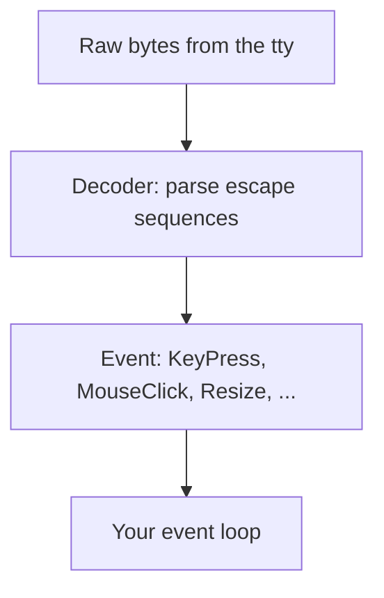

In [raw mode]() the terminal hands you a bare byte
stream. A keypress might be one byte (`a`), the click of a mouse might be a
dozen, and an arrow key arrives as a little escape sequence. uncurses turns that
stream into typed *events* so you match on `KeyPress` instead of decoding bytes
by hand. Because uncurses raw mode disables ISIG, keys like Ctrl-C and Ctrl-Z
arrive as key events instead of signals.

## From bytes to events

The path from a keystroke to something you can match on has three stops.



Escape sequences can straddle reads, so the decoder buffers partial input and
returns whole events. You never see the half-parsed middle.

## What an event can be

Events cover everything the terminal reports, not just keys:

- **Input**: `KeyPress`, `KeyRepeat`, `KeyRelease`, and the mouse family
  (`MouseClick`, `MouseRelease`, `MouseWheel`, `MouseMove`).
- **Lifecycle**: `Resize` when the window changes, `FocusIn` and `FocusOut`,
  and bracketed-paste events: `PasteStart`, `PasteChunk`, and `PasteEnd`.
- **Replies**: answers to questions you asked the terminal, like
  `CursorPosition`, `BackgroundColor`, `PrimaryDeviceAttributes`, or
  `ColorScheme`. Capability probing is opt-in through
  `program.query_capabilities(&[])?`; replies arrive on the same stream as user
  input.
- **Unknown**: anything the decoder recognizes the shape of but not the meaning,
  handed back as raw bytes rather than dropped.

## Reading through Program

Most apps read events from [`Program`](), because it
owns the terminal session and the event source.

```rust,no_run
use uncurses::event::{Event, KeyCode};
use uncurses::program::Program;

fn main() -> std::io::Result<()> {
    let mut program = Program::stdio()?;
    program.init()?;

    loop {
        match program.read_event()? {
            Event::KeyPress(key) if key.code == KeyCode::Char('q') => break,
            Event::KeyPress(key) => println!("pressed {:?}", key.code),
            _ => {}
        }
    }

    program.finish()
}
```

`read_event()` blocks until the next event. `poll_event(timeout)` waits up to a
timeout and reports whether something is ready, so you can interleave events
with timers or other work. `try_read_event()` pops an already-decoded event
without doing any I/O.

`read_event()` and `try_read_event()` auto-observe what they return. That means
ordinary reads update capability state, window size, terminal name, and
render-affecting replies for you. Values the terminal only reports on request,
such as the pixel sizes and the inline origin, are recorded the same way once
you have asked for them.

## The lower-level event source

An `EventSource` wraps an input handle and owns the decoder. Use it directly
when you are managing the terminal yourself, or when you need to share one
decoder with async code through `Program::event_source()`.

A read from a raw `EventSource`, a shared source, or `Program::event_stream()`
bypasses the program's automatic observation. If you want tracking to stay
current, feed each event to `program.observe_event(&event)?` yourself.

## Waking a blocked read

A `read` call blocks, which is a problem if another thread needs to stop the
loop. Every source can hand out a `Waker`: call it from anywhere, and the
blocked read returns early so your loop can notice a shutdown flag and exit
cleanly. No signals, no polling spin.

## Async, when you want it

If you would rather `await` events than block a thread, use
`Program::event_stream()` behind the `async` feature. It returns a
`futures_core::Stream` over the program's shared decoder, so events fit into a
`select!` alongside your other futures. Pass each event to `observe_event` if
you want the same tracking that `read_event()` gives you automatically. See the
[`EventStream` guide]() for the full
async pattern.

Input is one half of an interactive program; drawing into a
[surface]() is the other. The program's
[`Screen`]() is the pure renderer you paint, and the
program is where input and rendering meet.
