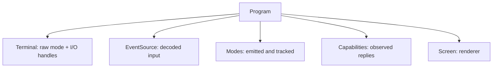

`Program<I, O>` is the interactive facade. It owns the terminal connection, the
decoded event source, capability state, terminal and input modes, and a
[`Screen`]() to render with. Drawing still happens on
`Screen`; `Program` is the session object around it.

## What it owns



Constructing a `Program` is inert. It opens or accepts handles and sizes the
renderer, but it does not enter raw mode and does not probe the terminal.

- `Program::stdio()` uses process stdin and stdout.
- `Program::open()` opens the controlling terminal (`/dev/tty`, or the Windows
  console), useful when stdio is redirected.
- `Program::new(terminal)` builds over an existing `Terminal<I, O>`.

## A minimal session

```rust,no_run
use uncurses::event::Event;
use uncurses::program::Program;
use uncurses::style::Style;
use uncurses::text::TextSurface;

fn main() -> std::io::Result<()> {
    let mut program = Program::stdio()?;
    program.init()?;
    program.enter_alt_screen()?;
    program.hide_cursor()?;

    program
        .screen_mut()
        .set_str((0, 0), "hello, uncurses!", Style::default());
    program.screen_mut().render()?;

    while !matches!(program.read_event()?, Event::KeyPress(_)) {}
    program.finish()
}
```

`init()` enters raw mode, sizes the managed area, applies the always-on options,
and prepares the renderer. `finish()` consumes the program, tears down the modes
that program emitted, flushes the renderer, and restores the terminal state.
There is no `Drop` teardown, so call `finish()` when the session is done.

Use `pause()` when you need to hand the terminal to a child process and keep the
program alive. Use `resume()` to re-enter raw mode, refit the managed area,
re-apply the modes this program emitted, and force a repaint. On Unix,
`suspend()` pauses and then stops the process with `SIGTSTP`; call `resume()`
after it returns.

## Drawing through the screen

`Program` has no `render()` and no `flush()`. Borrow the renderer with
`screen()` or `screen_mut()`:

```rust,no_run
use uncurses::program::Program;
use uncurses::style::Style;
use uncurses::text::TextSurface;

fn main() -> std::io::Result<()> {
    let mut program = Program::open()?;
    program.init()?;
    program.screen_mut().set_str((0, 0), "ready", Style::default());
    program.screen_mut().render()?;
    program.finish()
}
```

Most drawing uses the surface traits on `Screen`. The renderer is still a pure
cell grid and diff writer; the program just owns it for the duration of the
interactive session.

## Program emits every terminal mode

This is the governing rule: `Screen` never leaves a terminal mode on, beyond
the markers it wraps a single frame in and closes again. `Program`
emits every mode and pushes the render consequence into `Screen` with a plain
setter. For example, `Program::enter_alt_screen()` writes DECSET 1049 and calls
`screen.set_fullscreen(true)`. `Program::hide_cursor()` writes DECTCEM and calls
`screen.set_cursor_visible(false)`. `Program::enable_grapheme_clusters()` writes
DECSET 2027 and calls `screen.set_grapheme_clusters(true)`.

Use the `Program` methods for terminal modes:

- `enter_alt_screen()` and `exit_alt_screen()`
- `show_cursor()` and `hide_cursor()`
- `enable_mouse(..)` and `disable_mouse()`
- `enable_bracketed_paste()` and `disable_bracketed_paste()`
- `enable_focus_events()` and `disable_focus_events()`
- `enable_in_band_resize()` and `disable_in_band_resize()`
- `set_kitty_keyboard(..)`, `set_modify_other_keys(..)`, `set_title(..)`,
  `set_cursor_style(..)`, colors, clipboard, progress, pointer shape, `beep()`,
  `reset()`, and `restore()`

Each mode method writes its escape bytes and flushes immediately. Mode changes
are not deferred to the next frame.

## Teardown follows what Program emitted

`Program` records the modes it emitted. `finish()` and `pause()` tear down
exactly those modes, then restore the tty state. `resume()` re-applies exactly
those modes and invalidates the renderer so the next frame repaints cleanly.

Changing a render property directly through `program.screen_mut()` does not emit
a mode and is not part of that mode record. If you call
`program.screen_mut().set_fullscreen(true)`, the renderer switches to fullscreen
addressing, but the terminal never enters the alternate screen and teardown has
nothing to undo. Prefer `program.enter_alt_screen()`, `program.hide_cursor()`,
and `program.enable_grapheme_clusters()` in terminal apps, because they do both
halves.

## Reading events

The event methods live on `Program`:

- `read_event()` blocks until the next event.
- `poll_event(timeout)` waits up to a timeout and reports readiness.
- `try_read_event()` returns an already-decoded event without blocking.
- `unread_event(event)` pushes one event back to the front of the queue.

`read_event()` and `try_read_event()` automatically observe the events they
return. That keeps capability state, window size, terminal name, the recorded
origin, and render-affecting replies up to date. If you take events from
`event_stream()` or the shared `event_source()`, pass each event to
`observe_event(&event)?` yourself.

Observing records, it never queries. Nothing in the read path asks the terminal
a question, so no reply lands on your event stream that you did not ask for.
The flip side is that values a terminal only reports on request go stale on
their own: the pixel sizes and the inline origin are refreshed when you call
`request_window_pixel_size()`, `request_cell_pixel_size()`, and
`request_origin()`, and not before.

## Capability queries are opt-in

`init()` does not probe the terminal. Querying is explicit:

```rust,no_run
use std::time::{Duration, Instant};
use uncurses::event::Event;
use uncurses::program::Program;

fn main() -> std::io::Result<()> {
    let mut program = Program::stdio()?;
    program.init()?;
    program.query_capabilities(&[])?;

    let deadline = Instant::now() + Duration::from_millis(300);
    while let Some(timeout) = deadline.checked_duration_since(Instant::now()) {
        if !program.poll_event(Some(timeout))? {
            break;
        }
        if matches!(program.try_read_event()?, Some(Event::PrimaryDeviceAttributes(_))) {
            break;
        }
    }

    let _caps = program.capabilities();
    program.finish()
}
```

`capabilities()` holds the replies themselves, not a summary of them. See
[what the terminal told us](#what-the-terminal-told-us) below.

`query_capabilities(&[])` writes the default query set and a Primary DA request
last. You are responsible for consuming the replies. Read events until
`Event::PrimaryDeviceAttributes` arrives, because that reply is the sentinel
that every earlier reply has been delivered. A silent terminal may never answer,
so bound the wait with `poll_event(Some(timeout))`.

An ordinary event loop also works, because `read_event()` observes replies
automatically as they pass through.

## What the terminal told us

`Capabilities` stores the replies rather than a set of booleans, because a
boolean cannot express the difference between "the terminal said no" and "the
terminal never answered". Every accessor that can be unanswered returns an
`Option`, and `None` always means silence.

```rust,no_run
use uncurses::ansi::mode::{Mode, ModeSetting};
use uncurses::program::Program;

fn main() -> std::io::Result<()> {
    let mut program = Program::stdio()?;
    program.init()?;
    program.query_capabilities(&[])?;
    // ... read events until Event::PrimaryDeviceAttributes ...

    let caps = program.capabilities();

    // The reported state, for any mode you asked about.
    match caps.mode(Mode::SYNCHRONIZED_OUTPUT) {
        Some(ModeSetting::PermanentlySet) => {} // on, and cannot be turned off
        Some(ModeSetting::NotRecognized) => {}  // a definite no
        Some(_) => {}                           // available
        None => {}                              // never answered
    }

    // Or just the yes/no question.
    let _pixels = caps.supports(Mode::MOUSE_SGR_PIXEL);

    // Raw replies for the non-mode queries.
    let _da = caps.primary_device_attributes();
    let _kitty = caps.kitty_keyboard();
    let _mok = caps.modify_other_keys();
    let _name = caps.terminal_name();

    program.finish()
}
```

The other half of what a program knows about its terminal never arrives as a
reply at all. `program.env()` is the environment snapshot the terminal
captured, so `TERM`, `COLORTERM`, and `TERM_PROGRAM` are readable without
reaching for `std::env`, and they stay the values the session started with.
`program.terminal()` borrows the terminal itself for its size and tty queries.
Both are read-only: the program tracks the modes and raw-mode state it emitted
so it can restore them, and a mutable terminal would let that record drift.

`Capabilities` holds only replies, so it deliberately answers no question that
another source can answer too. There is no `true_color()`, for instance:
direct color is established by `COLORTERM` and `TERM` as readily as by an
XTGETTCAP reply, so the answer is the render profile,
`program.screen().color_profile()`, which already folds in both. See
[Color](). The reply itself is still here as
`supports_termcap("RGB")` if you want to know how the profile was reached.

Every reply a terminal can send about itself lands here, not just the ones the
program acts on, so anything you send through `query_capabilities`'s `extra`
bytes is readable afterwards. Besides the modes and the values above:

| Reply | Accessor |
| --- | --- |
| Secondary/Tertiary DA | `secondary_device_attributes()`, `tertiary_device_attributes()` |
| XTGETTCAP capability | `termcap(name)`, `supports_termcap(name)`, `termcap_reports()` |
| DECRQSS setting | `setting(selector)`, `settings()` |
| `OSC 10`/`11`/`12` colors | `foreground_color()`, `background_color()`, `cursor_color()` |
| `OSC 4` palette entries | `palette_color(index)`, `palette()` |
| DEC 2031 color scheme | `color_scheme()` |
| Kitty graphics response | `kitty_graphics()` |

`modes()`, `palette()`, `termcap_reports()`, and `settings()` return the whole
map for each, so you can iterate everything the terminal answered.

DECRQSS is the odd one out: nothing asks for it by default, since it reports
current settings rather than what a terminal can do. Ask with
`uncurses::ansi::status::write_decrqss` through `query_capabilities`'s `extra`
bytes, passing the selector of the control function you want, `"m"` for SGR or
`" q"` for the cursor style. The reply arrives as `Event::SettingReport`,
either `Refused` or `Raw` holding the whole CSI sequence the terminal sent.
`Raw` replies are recorded under their control function alone, so a `">4m"`
request lands under `">m"` with the full `">4;2m"` as its value, which is what
keeps xterm's `XTQMODKEYS` from overwriting SGR.

Two of these keep changing after the initial query rather than answering once.
`color_scheme()` tracks the latest DEC 2031 report while
`enable_color_scheme_updates` is on, so it follows the user toggling dark and
light mode. `kitty_graphics()` is set by any graphics response, including the
acknowledgements a terminal sends while you transmit images.

The colors are the terminal's own, which is the opposite side of what
`Program` tracks for restore. Calling `set_background_color` does not change
what `capabilities().background_color()` reports: one is what the terminal told
you, the other is what you told the terminal.

## Options and defaults

Most of `ProgramOptions` is startup behavior that can be emitted without
probing: `bracketed_paste` and `mouse` both take effect during `init`.

Two fields are discovery-driven instead. `prefer_grapheme_clusters` and
`prefer_in_band_resize` both default to `true`, but they emit nothing at init.
They act only when a mode report proves the terminal supports DEC mode 2027 or
2048, which means they stay dormant unless you call `query_capabilities` and
read the replies. Adopting a mode this way goes through the same path as
calling `enable_grapheme_clusters` or `enable_in_band_resize` yourself, so it
is recorded in the emitted-mode set and `finish()` undoes it. Each is enabled
at most once, so a repeated report does not re-emit.

Set either to `false` to keep detection without adoption: the capability is
still recorded in `capabilities()`, the mode is simply never enabled.
