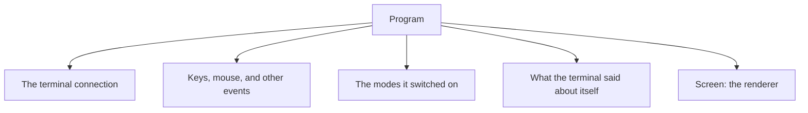

`Program<I, O>` runs an interactive terminal session. It holds the connection to
the terminal, turns arriving bytes into events, remembers what the terminal said
about itself and which modes it switched on, and owns a
[`Screen`]() for the drawing. Drawing still happens on
`Screen`; `Program` is everything around it.

## What it owns



Creating a `Program` does nothing to the terminal. It takes the input and output
handles and sizes the renderer to fit, and that is all. Starting the session and
asking the terminal any questions both wait for you to ask.

- `Program::stdio()` uses the process's own input and output.
- `Program::open()` talks to the terminal directly, which is what you want when
  input or output has been redirected.
- `Program::new(terminal)` builds on a terminal you already have.

## A minimal session

```rust
use uncurses::event::Event;
use uncurses::program::Program;
use uncurses::style::Style;
use uncurses::text::TextSurface;

fn main() -> std::io::Result<()> {
    let mut program = Program::stdio()?;
    program.init()?;
    program.enter_alt_screen()?;
    program.hide_cursor()?;

    let screen = program.screen_mut();
    screen.set_str((0, 0), "hello, uncurses!", Style::default());
    screen.render()?;

    while !matches!(program.read_event()?, Event::KeyPress(_)) {}
    program.finish()
}
```

`init()` starts the session. It puts the terminal into raw mode, so keystrokes
arrive as you press them instead of a line at a time, and sizes the drawing area
to fit. `finish()` ends the session, switching off everything the program
switched on and handing the terminal back as it found it. Nothing tidies up on
its own, so call `finish()` when you are done.

`pause()` hands the terminal back temporarily, which is what you want before
running something like an editor, while keeping your program alive. `resume()`
takes it back and forgets what was on screen, so your next `render()` draws
everything. On Unix, `suspend()` pauses and then stops the
process the way Ctrl+Z does; call `resume()` once it starts again.

## Drawing through the screen

Drawing lives on [`Screen`](). Borrow it with
`screen()` or `screen_mut()`, and keep the binding for as long as you are
drawing:

```rust
loop {
    let screen = program.screen_mut();
    screen.set_str((0, 0), "ready", Style::default());
    screen.render()?;

    if matches!(program.read_event()?, Event::KeyPress(_)) {
        break;
    }
}
```

The borrow ends at the binding's last use, so `program` is usable again on the
next line, including inside an event loop like this one. Reach for
`program.screen_mut()` inline when you only have a single call to make, such as
a `resize` in a match arm.

Drawing works here exactly as it does on any other
[surface](). The screen is still just a grid of
cells that knows how to paint itself; the program only owns it for the length of
the session.

## Program drives the screen

Some of what a program turns on changes how the screen should draw, and
`Program` is what keeps the two in agreement. Moving to the alt screen is the
clearest case: the terminal has to switch buffers, and the screen has to know it
now covers the whole window instead of a few rows. Showing and hiding the cursor
is the other.

`Program` does both halves in a single call. `enter_alt_screen()` moves the
terminal and tells the screen; `hide_cursor()` hides the cursor and tells the
screen. Reach for these rather than setting the screen's half yourself, or the
two end up disagreeing about what the terminal is actually doing.

Some of what `Program` learns is between it and the terminal alone: mouse
reporting, bracketed paste, and the window title change nothing about how a
frame is drawn, so the screen is never told. Some of it does reach the screen,
though never as a mode the screen emits: an environment-derived color profile,
tab and backspace optimizations after raw mode, and synchronized output once a
mode report proves the terminal understands it. The [`Program` API
reference](/api/uncurses/program/struct.Program.html) has the full set.

## Reading events

Input belongs to `Program`. It can block for the next event, wait with a
timeout, or take one without blocking, whichever suits the loop you are writing.

Reads through `Program` observe what they return, which is what keeps
capabilities, the window size, and the renderer current without any bookkeeping
on your part. If you take events from the shared event source or an async stream
instead, hand each one to `observe_event` so the same updates still happen. See
[Events]().

Observing records, it never queries. Nothing in the read path asks the terminal
a question, so no reply reaches your loop that you did not ask for. The flip
side is that anything a terminal only reports on request, such as the pixel
sizes and the inline origin, goes stale until you ask again.

## Startup options

`ProgramOptions` carries the startup behavior that `init` applies for you, so
things like bracketed paste or mouse reporting are on before your first frame
rather than being separate calls after it.

Three options act on what the terminal reports about itself instead of
being emitted outright, which means they stay dormant until you query. That
story lives with the rest of discovery in
[Capabilities](), along with everything a
terminal can tell you and how to ask.
