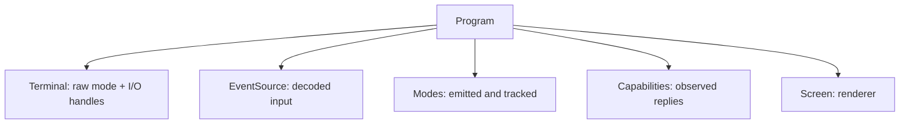

`Program<I, O>` is the interactive facade. It owns the terminal connection, the
decoded event source, capability state, terminal and input modes, and a
[`Screen`]() to render with. Drawing still happens on
`Screen`; `Program` is the session object around it.

## What it owns



Constructing a `Program` is inert: it opens or accepts handles and sizes the
renderer. Raw mode and terminal probing each wait for an explicit call.

- `Program::stdio()` uses process stdin and stdout.
- `Program::open()` opens the controlling terminal (`/dev/tty`, or the Windows
  console), useful when stdio is redirected.
- `Program::new(terminal)` builds over an existing `Terminal<I, O>`.

## A minimal session

```rust,no_run
use uncurses::event::Event;
use uncurses::program::Program;
use uncurses::style::Style;
use uncurses::text::TextSurface;

fn main() -> std::io::Result<()> {
    let mut program = Program::stdio()?;
    program.init()?;
    program.enter_alt_screen()?;
    program.hide_cursor()?;

    let screen = program.screen_mut();
    screen.set_str((0, 0), "hello, uncurses!", Style::default());
    screen.render()?;

    while !matches!(program.read_event()?, Event::KeyPress(_)) {}
    program.finish()
}
```

`init()` enters raw mode, sizes the managed area, applies the always-on options,
and prepares the renderer. `finish()` consumes the program, tears down the modes
that program emitted, flushes the renderer, and restores the terminal state.
Teardown is explicit, so call `finish()` when the session is done.

Use `pause()` when you need to hand the terminal to a child process and keep the
program alive. Use `resume()` to re-enter raw mode, refit the managed area,
re-apply the modes this program emitted, and force a repaint. On Unix,
`suspend()` pauses and then stops the process with `SIGTSTP`; call `resume()`
after it returns.

## Drawing through the screen

Rendering lives on [`Screen`](). Borrow it with
`screen()` or `screen_mut()`, and keep the binding for as long as you are
drawing:

```rust,no_run
use uncurses::event::Event;
use uncurses::program::Program;
use uncurses::style::Style;
use uncurses::text::TextSurface;

fn main() -> std::io::Result<()> {
    let mut program = Program::open()?;
    program.init()?;

    loop {
        let screen = program.screen_mut();
        screen.set_str((0, 0), "ready", Style::default());
        screen.set_str((0, 1), "press any key", Style::default());
        screen.render()?;

        if matches!(program.read_event()?, Event::KeyPress(_)) {
            break;
        }
    }
    program.finish()
}
```

The borrow ends at the binding's last use, so `program` is usable again on the
next line, including inside an event loop. Reach for `program.screen_mut()`
inline when you only have a single call to make, such as a `resize` in a match
arm.

Most drawing uses the surface traits on `Screen`. The renderer is still a pure
cell grid and diff writer; the program just owns it for the duration of the
interactive session.

## Program emits every terminal mode

This is the governing rule: `Screen` never leaves a terminal mode on, beyond
the markers it wraps a single frame in and closes again. `Program`
emits every mode and pushes the render consequence into `Screen` with a plain
setter. For example, `Program::enter_alt_screen()` writes DECSET 1049 and calls
`screen.set_fullscreen(true)`. `Program::hide_cursor()` writes DECTCEM and calls
`screen.set_cursor_visible(false)`. `Program::enable_grapheme_clusters()` writes
DECSET 2027 and calls `screen.set_grapheme_clusters(true)`.

Use the `Program` methods for terminal modes:

- `enter_alt_screen()` and `exit_alt_screen()`
- `show_cursor()` and `hide_cursor()`
- `enable_mouse(..)` and `disable_mouse()`
- `enable_bracketed_paste()` and `disable_bracketed_paste()`
- `enable_focus_events()` and `disable_focus_events()`
- `enable_in_band_resize()` and `disable_in_band_resize()`
- `set_kitty_keyboard(..)`, `set_modify_other_keys(..)`, `set_title(..)`,
  `set_cursor_style(..)`, colors, clipboard, progress, pointer shape, `beep()`,
  `reset()`, and `restore()`

Each mode method writes its escape bytes and flushes immediately. Mode changes
are not deferred to the next frame.

## Teardown follows what Program emitted

`Program` records the modes it emitted. `finish()` and `pause()` tear down
exactly those modes, then restore the tty state. `resume()` re-applies exactly
those modes and invalidates the renderer so the next frame repaints cleanly.

Changing a render property directly through `program.screen_mut()` does not emit
a mode and is not part of that mode record. If you call
`program.screen_mut().set_fullscreen(true)`, the renderer switches to fullscreen
addressing, but the terminal never enters the alternate screen and teardown has
nothing to undo. Prefer `program.enter_alt_screen()`, `program.hide_cursor()`,
and `program.enable_grapheme_clusters()` in terminal apps, because they do both
halves.

## Reading events

The event methods live on `Program`:

- `read_event()` blocks until the next event.
- `poll_event(timeout)` waits up to a timeout and reports readiness.
- `try_read_event()` returns an already-decoded event without blocking.
- `unread_event(event)` pushes one event back to the front of the queue.

`read_event()` and `try_read_event()` automatically observe the events they
return. That keeps capability state, window size, terminal name, the recorded
origin, and render-affecting replies up to date. If you take events from
`event_stream()` or the shared `event_source()`, pass each event to
`observe_event(&event)?` yourself.

Observing records, it never queries. Nothing in the read path asks the terminal
a question, so no reply lands on your event stream that you did not ask for.
The flip side is that values a terminal only reports on request go stale on
their own: the pixel sizes and the inline origin are refreshed when you call
`request_window_pixel_size()`, `request_cell_pixel_size()`, and
`request_origin()`, and not before.

## Startup options

`ProgramOptions` carries the startup behavior that `init` can emit directly:
`bracketed_paste` and `mouse`.

Two more options, `prefer_grapheme_clusters` and `prefer_in_band_resize`, act on
what the terminal reports about itself. Those live with the rest of the
discovery story in [Capabilities](), along with
everything a terminal can tell you and how to ask.
