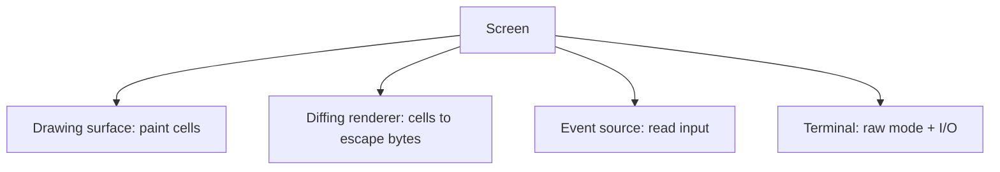
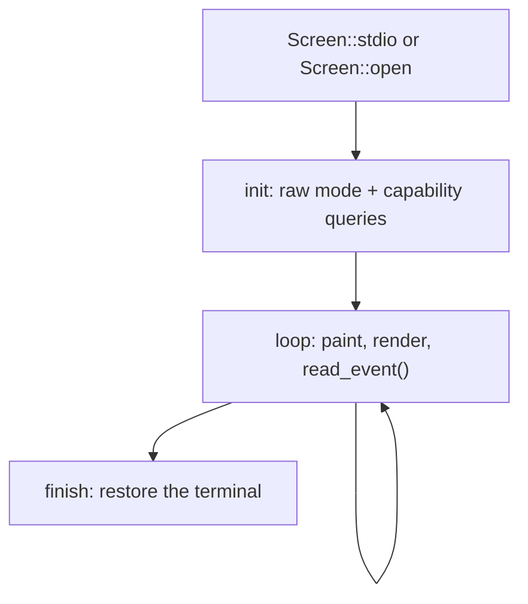
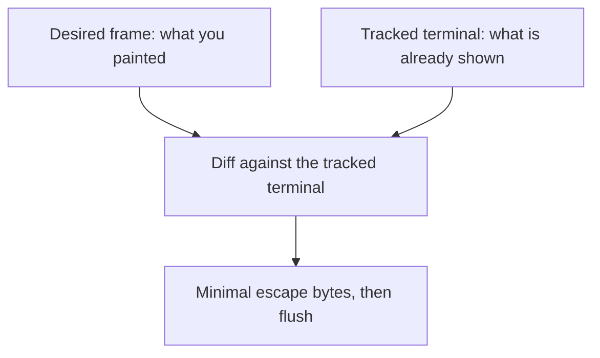

`Screen` is the main object most apps use. It brings the other concepts
together behind one object: a drawing [surface]() to
paint into, an [event source]() to read events from, and
the [terminal]() connection underneath, plus a
diffing renderer that gets your changes onto the screen with the fewest bytes.

## What it brings together



You paint into a `Screen` exactly like any other surface, read events straight
from it, and let it manage raw mode and teardown. The four pieces you would
otherwise wire together by hand are owned and coordinated for you.

## The lifecycle

A session has a clear shape: open, set up, loop, and hand the terminal back.



```rust
use uncurses::event::{Event, KeyCode};
use uncurses::screen::Screen;
use uncurses::style::Style;
use uncurses::text::TextSurface;

fn main() -> std::io::Result<()> {
    let mut screen = Screen::stdio()?;
    screen.init()?;                                    // raw mode + capability queries
    loop {
        screen.set_str((0, 0), "Press q to quit", Style::default());
        screen.render()?;                              // diff against the terminal, flush
        let ev = screen.read_event()?;                  // pure read, no capability tracking
        screen.observe_event(&ev)?;                     // optional capability tracking
        if let Event::KeyPress(key) = ev {
            if key.code == KeyCode::Char('q') {
                break;
            }
        }
    }
    screen.finish()                                    // restore the terminal
}
```

`init` enters raw mode and sends capability queries; `finish` drains pending
query replies, resets modes and the managed area, then restores the terminal.
Bracket every session with `init` and `finish` so the user's shell is handed
back cleanly.


[`Screen::read_event`](/api/uncurses/screen/struct.Screen.html#method.read_event),
[`Screen::try_read_event`](/api/uncurses/screen/struct.Screen.html#method.try_read_event),
[`Screen::poll_event`](/api/uncurses/screen/struct.Screen.html#method.poll_event),
and [`Screen::event_stream`](/api/uncurses/screen/struct.Screen.html#method.event_stream)
are pure reads: they do not update capabilities, resize state, or discovery
defaults. Feeding each event through
[`screen.observe_event(&ev)?`](/api/uncurses/screen/struct.Screen.html#method.observe_event)
is optional; it keeps runtime tracking for mouse, kitty keyboard, in-band
resize, truecolor, and grapheme support alive. Skipping it still reads fine.
ratatui's backend follows the same pure-read contract.


## Drawing is a diff

`render` is where the renderer earns its keep. `Screen` keeps a *desired* frame
(the cells you painted) and a memory of what it believes is already on the
terminal. On each `render` it compares the two and emits escape bytes only for
the cells that actually changed.



Repaint the whole frame every loop if you like; if only one cell changed, only
one cell is written. That is what makes a redraw-everything style cheap, and it
is why you describe *what the frame should look like* rather than hand-managing
cursor moves and clears.

## Inline or fullscreen

A `Screen` starts *inline*: it draws on the rows where the cursor already is,
right inside the normal scrollback, and the cursor stays visible. That suits a
prompt, a progress display, or any widget that lives among the shell's output.

For a takeover interface, enter the *alternate screen*: a separate full-window
buffer that leaves the shell's scrollback untouched and is restored on the way
out. It is the right mode for an editor or a dashboard that owns the whole
window.

<figure class="term-fig"><div class="term-windows"><div class="term-win"><div class="bar"><i></i><i></i><i></i><span>inline</span></div><div class="row">$ cargo build</div><div class="row">Compiling app v0.1.0</div><div class="row app">[####----] linking</div><div class="row app">3 of 8 crates done</div><div class="row">$ </div></div><div class="term-win"><div class="bar"><i></i><i></i><i></i><span>fullscreen</span></div><div class="row app">File  Edit  View</div><div class="row app">1  fn main() {</div><div class="row app">2      run();</div><div class="row app">3  }</div><div class="row app">~</div></div></div><figcaption>The highlighted rows are what the Screen owns. Inline draws a few live rows and hands them back, with unmanaged output (like the build log) scrolling above; fullscreen takes over the whole window on the alternate screen.</figcaption></figure>

Either way you paint the same surface and read the same events; only the canvas
differs.

## Drawing is deferred, modes are immediate

Painting cells does not touch the terminal. `set_str`, `set_cell`, and the rest
only update the in-memory frame; the bytes are sent when you `render`, which
diffs that frame against the terminal and writes just the difference. Painting
is infallible, and `render` does the output.

Mode changes work the other way. Entering the alternate screen, hiding the
cursor, enabling mouse reporting, setting the title, and similar switches take
effect immediately. Each writes its escape sequence on the spot instead of
waiting for the next `render`. That is why those methods return a `Result` while
painting does not.

## Placing the cursor

Where the cursor rests after a frame is part of the frame, so you stage it the
same way you stage cells. `set_cursor_position((x, y))` records a
resting position that `render` applies at the end of every frame, inside the same
frame bracket as the cell diff so the cursor lands in one clean step instead of
skittering across the row. It is sticky: set it once and each `render` parks the
cursor right back there, even as the diff churns the screen underneath. Call
`clear_cursor_position` to forget the request and let the cursor stay wherever
the diff left it.

```rust
// A text field that wants the caret at the edit position every frame.
screen.set_str((0, 0), &input, Style::default());
screen.set_cursor_position((caret_col, 0));
screen.render()?; // paints the line and rests the cursor at the caret
```

Cursor *visibility* is a separate switch: `show_cursor` and `hide_cursor` decide
whether the cursor is drawn at all, independent of where it rests. Staging a
position never reveals a hidden cursor, and hiding the cursor never forgets the
staged position.

When you do need to move the cursor right now, outside the frame loop,
`move_cursor_to` and `move_cursor_by` move it immediately and flush, the way the
mode toggles do. They are imperative and do not disturb the sticky resting
position, so the next `render` snaps the cursor back to it. Reach for them for
one-off moves; reach for `set_cursor_position` for the per-frame caret.

## Atomic frames

By default a `render` writes the diff straight to the terminal, and a visible
cursor is hidden around it so it does not dance across cells while the renderer
repositions it. Synchronized output (DEC mode 2026) is the better tool when the
terminal supports it: `set_synchronized_output(true)` wraps each frame in
begin/end markers so a supporting terminal paints the whole frame at once, with
no mid-frame repaint and no tearing.

```rust
screen.set_synchronized_output(true); // present each frame atomically
```

This is your switch to flip. uncurses turns it on automatically when the
terminal advertises 2026 support during `init`, but it never second-guesses you:
flip it back off whenever you like. With synchronized output on, the per-frame
cursor hide/show is dropped, since the frame already arrives in one piece.
Toggling the cursor every frame would otherwise reset its blink phase, which
shows up as a flickering caret, so leaving it alone keeps the cursor steady.
