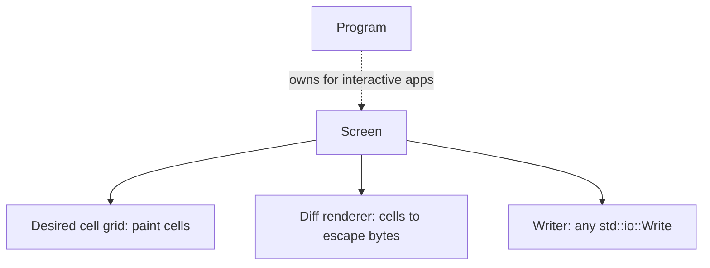
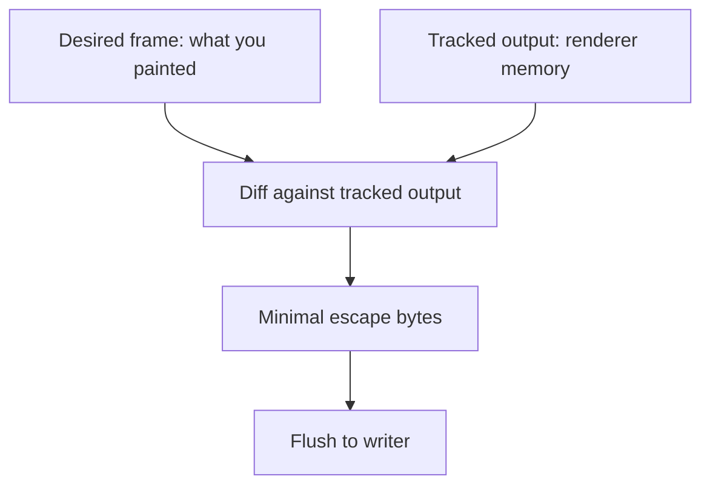

`Screen<W>` is the renderer. It owns a desired cell grid, a diff renderer, and
one writer, where `W: std::io::Write`. That writer can be a terminal handle, a
`Vec<u8>`, a file, or anything else that accepts bytes. `Screen` has no input
side, no raw-mode lifecycle, no event source, and no terminal session.

For an interactive application, reach this renderer through
[`Program::screen_mut`](). For output-only work,
snapshot tests, transcripts, and offscreen rendering, use `Screen` by itself.

## What it owns



The type has one generic parameter, the writer. The old `Screen<I, O>` session
object was split: [`Program`]() owns the terminal,
events, capabilities, and modes; `Screen<W>` only renders frames.

## Constructing one

`Screen::new(writer, size)` is infallible and performs no I/O. There is no
`Screen::stdio()` or `Screen::open()`, because opening a terminal is a session
concern and belongs to [`Program`]().

```rust
use uncurses::screen::Screen;
use uncurses::style::Style;
use uncurses::text::TextSurface;

fn main() -> std::io::Result<()> {
    let mut screen = Screen::new(Vec::new(), (20, 1));
    screen.set_str((0, 0), "hello", Style::default());
    screen.render()?;
    assert!(!screen.writer().is_empty());
    Ok(())
}
```

Drawing methods update the in-memory frame. `render()` diffs that frame against
what the renderer believes is already shown, writes only the changes, and
flushes. `flush()` is also on `Screen`. `Program` has no `render` method, so an
interactive app renders with `program.screen_mut().render()?`.

## Drawing is a diff



Repaint the whole frame every loop if you like. If only one cell changed, only
that change is written. That is why drawing code describes what the frame should
look like instead of hand-managing cursor moves and clears.

`Screen` implements the surface traits, so the same drawing code works on a
buffer, a view, a text buffer, or the live renderer. It also implements
`std::io::Write`, which stages raw bytes in order with the renderer's own output
before the next flush.

## Inline or fullscreen

A `Screen` starts inline: the managed area is a band in the normal buffer,
addressed relative to where the terminal cursor already sits. Fullscreen means
the managed area is the whole viewport, addressed with absolute moves. That
matches the alternate screen buffer, but it is only a render property.

<figure class="term-fig"><div class="term-windows"><div class="term-win"><div class="bar"><i></i><i></i><i></i><span>inline</span></div><div class="row">$ cargo build</div><div class="row">Compiling app v0.1.0</div><div class="row app">[####----] linking</div><div class="row app">3 of 8 crates done</div><div class="row">$ </div></div><div class="term-win"><div class="bar"><i></i><i></i><i></i><span>fullscreen</span></div><div class="row app">File  Edit  View</div><div class="row app">1  fn main() {</div><div class="row app">2      run();</div><div class="row app">3  }</div><div class="row app">~</div></div></div><figcaption>The highlighted rows are what the Screen owns. Inline draws a few live rows and hands them back, with unmanaged output (like the build log) scrolling above; fullscreen renders as if the whole viewport is the managed surface.</figcaption></figure>

## Screen never emits a terminal mode

This is the governing rule: `Screen` never leaves a terminal mode on. It emits
frame bytes only, and the two modes that do appear in its output, the
synchronized-output and cursor-visibility markers wrapped around a frame, are
closed again before `render` returns. Every render property setter is
infallible and writes nothing:

- `set_fullscreen(bool)`
- `set_cursor_visible(bool)`
- `set_grapheme_clusters(bool)`
- `set_synchronized_output(bool)`
- `set_color_profile(..)`
- `set_optimizations(..)`

The matching getters report the renderer state, not live terminal state. These
setters are useful when you drive a bare writer or when tests need a specific
rendering mode.

Terminal modes belong to [`Program`](). For example,
`Program::enter_alt_screen()` writes DECSET 1049 and then calls
`screen.set_fullscreen(true)`. `Program::hide_cursor()` writes DECTCEM and then
calls `screen.set_cursor_visible(false)`. Use the `Program` methods in terminal
apps so the terminal and renderer stay in step.

## Cursor placement

Where the cursor rests after a frame is part of the frame. Call
`set_cursor_position((x, y))` to stage a sticky resting position, then `render()`
applies it at the end of every frame. Call `clear_cursor_position()` to stop
steering it.

Cursor visibility is different. `Screen::set_cursor_visible(false)` only tells
the renderer that the terminal cursor is hidden, so the frame bracket is correct.
It does not hide the cursor. In a terminal app, call `program.hide_cursor()?` or
`program.show_cursor()?` instead.

`move_cursor_to` and `move_cursor_by` are immediate cursor moves through the
writer. They flush now and do not change the sticky resting position.

## Atomic frames

`synchronized_output` is also only a render property. When enabled, each
non-empty `render()` wraps the frame in synchronized-output begin and end
markers, so terminals that support DEC mode 2026 can present the whole frame at
once. `Screen::set_synchronized_output(true)` writes nothing when you call it;
the begin and end markers are emitted only as part of `render()` frame bytes.
`Program::observe_event` sets the property automatically after a capability
reply proves support, and you can override it at any time.
