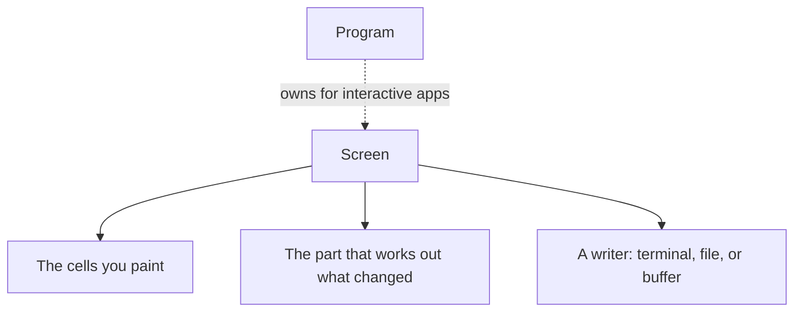
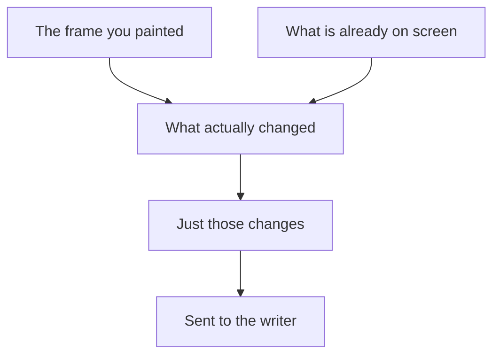

`Screen<W>` is the renderer. It holds the grid of cells you paint into and one
writer to send the finished frame to. That writer can be a terminal, a
`Vec<u8>`, a file, or anything else that accepts bytes. Drawing is its whole
job: reading input, starting a session, and managing the terminal all live on
[`Program`]().

For an interactive application, reach the renderer through
[`Program`](). For output-only work, snapshot tests,
transcripts, and offscreen rendering, use `Screen` by itself.

## What it owns



The writer is the only thing you choose. That is the whole split:
[`Program`]() deals with the terminal, and `Screen`
draws frames.

## Constructing one

`Screen::new(writer, size)` cannot fail and touches nothing. Hand it a writer you
already have. Opening a terminal belongs to the session, so it belongs to
[`Program`]().

```rust
use uncurses::screen::Screen;
use uncurses::style::Style;
use uncurses::text::TextSurface;

fn main() -> std::io::Result<()> {
    let mut screen = Screen::new(Vec::new(), (20, 1));
    screen.set_str((0, 0), "hello", Style::default());
    screen.render()?;
    assert!(!screen.writer().is_empty());
    Ok(())
}
```

Drawing methods change the frame held in memory. `render()` compares it against
what is already on screen, sends only the differences, and flushes. Both
`render()` and `flush()` live on the renderer, so an interactive app borrows it
from the program first.

## Drawing is a diff



Repaint the whole frame every loop if you like. If only one cell changed, only
that cell is sent. That is why drawing code can describe what the frame should
look like instead of tracking cursor moves and clears by hand.

The same drawing methods work on a buffer, a view, a text buffer, or the live
renderer, because they all share the same
[surface]() interface. `Screen` also accepts raw
bytes written straight to it, and keeps them in order with its own output.

## Inline or fullscreen

A `Screen` starts inline: it owns a band of rows in the normal terminal window,
positioned relative to wherever the cursor already sits, and everything above it
scrolls past as usual. Fullscreen means it owns the whole window instead. That
lines up with the alt screen, so in a terminal app switch it through
[`Program`](), which moves the terminal and the
screen together.

<figure class="term-fig"><div class="term-windows"><div class="term-win"><div class="bar"><i></i><i></i><i></i><span>inline</span></div><div class="row">$ cargo build</div><div class="row">Compiling app v0.1.0</div><div class="row app">[####----] linking</div><div class="row app">3 of 8 crates done</div><div class="row">$ </div></div><div class="term-win"><div class="bar"><i></i><i></i><i></i><span>fullscreen</span></div><div class="row app">File  Edit  View</div><div class="row app">1  fn main() {</div><div class="row app">2      run();</div><div class="row app">3  }</div><div class="row app">~</div></div></div><figcaption>The highlighted rows are what the Screen owns. Inline draws a few live rows and hands them back, with everything else (like the build log) scrolling above; fullscreen draws over the whole window.</figcaption></figure>
