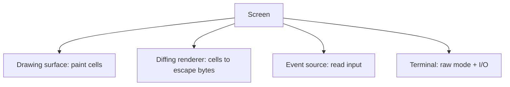
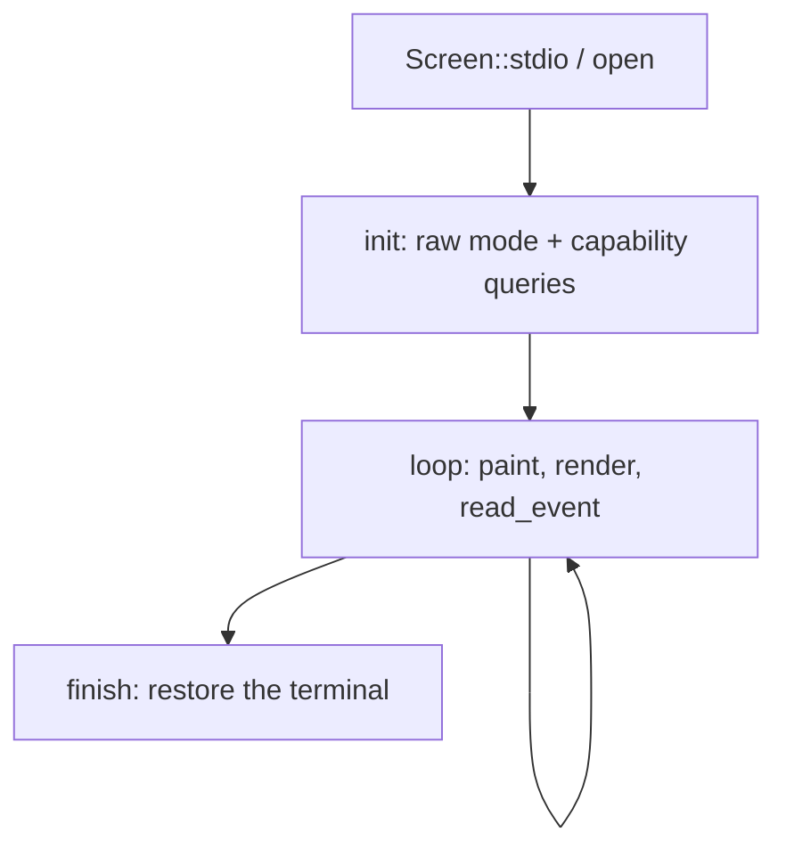
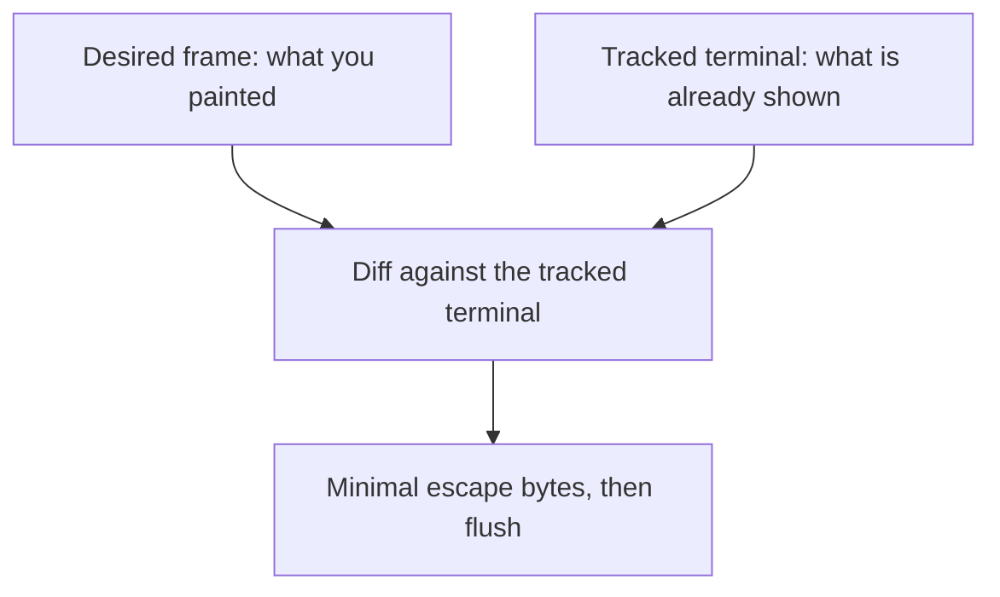

`Screen` is the facade most apps actually use. It brings the other concepts
together behind one object: a drawing [surface]() to
paint into, an [event source]() to read input from, and
the [terminal]() connection underneath, plus a
diffing renderer that gets your changes onto the screen with the fewest bytes.

## What it brings together



You paint into a `Screen` exactly like any other surface, read events straight
from it, and let it manage raw mode and teardown. The four pieces you would
otherwise wire together by hand are owned and coordinated for you.

## The lifecycle

A session has a clear shape: open, set up, loop, and hand the terminal back.



```rust
use uncurses::event::{Event, KeyCode};
use uncurses::screen::Screen;
use uncurses::style::Style;
use uncurses::text::TextSurface;

fn main() -> std::io::Result<()> {
    let mut screen = Screen::stdio()?;
    screen.init()?;                                    // raw mode + capability queries
    loop {
        screen.set_str((0, 0), "Press q to quit", Style::default());
        screen.render()?;                              // diff against the terminal, flush
        if let Event::KeyPress(key) = screen.read_event()? {
            if key.code == KeyCode::Char('q') {
                break;
            }
        }
    }
    screen.finish()                                    // restore the terminal
}
```

`init` borrows raw mode and stages its capability queries; `finish` tears
everything back down and restores the terminal exactly as it was. Skipping
`finish` leaves the user in a broken shell, so it is the one call you never
forget.

## Drawing is a diff

`render` is where the renderer earns its keep. `Screen` keeps a *desired* frame
(the cells you painted) and a memory of what it believes is already on the
terminal. On each `render` it compares the two and emits escape bytes only for
the cells that actually changed.



Repaint the whole frame every loop if you like; if only one cell changed, only
one cell is written. That is what makes a redraw-everything style cheap, and it
is why you describe *what the frame should look like* rather than hand-managing
cursor moves and clears.

## Inline or fullscreen

A `Screen` starts *inline*: it draws on the rows where the cursor already is,
right inside the normal scrollback, and the cursor stays visible. That suits a
prompt, a progress display, or any widget that lives among the shell's output.

For a takeover interface, enter the *alternate screen*: a separate full-window
buffer that leaves the shell's scrollback untouched and is restored on the way
out. It is the right mode for an editor or a dashboard that owns the whole
window.

<figure class="term-fig"><div class="term-windows"><div class="term-win"><div class="bar"><i></i><i></i><i></i><span>inline</span></div><div class="row">$ cargo build</div><div class="row">Compiling app v0.1.0</div><div class="row app">[####----] linking</div><div class="row app">3 of 8 crates done</div><div class="row">$ </div></div><div class="term-win"><div class="bar"><i></i><i></i><i></i><span>fullscreen</span></div><div class="row app">File  Edit  View</div><div class="row app">1  fn main() {</div><div class="row app">2      run();</div><div class="row app">3  }</div><div class="row app">~</div></div></div><figcaption>The highlighted rows are what the Screen owns. Inline draws a few live rows and hands them back, with unmanaged output (like the build log) scrolling above; fullscreen takes over the whole window on the alternate screen.</figcaption></figure>

Either way you paint the same surface and read the same events; only the canvas
differs.

## Drawing is deferred, modes are immediate

Painting cells does not touch the terminal. `set_str`, `set_cell`, and the rest
only update the in-memory frame; the bytes are sent when you `render`, which
diffs that frame against the terminal and writes just the difference. Painting
is infallible, and `render` does the output.

Mode changes work the other way. Entering the alternate screen, hiding the
cursor, enabling mouse reporting, setting the title, and similar switches take
effect immediately: each writes its escape sequence on the spot rather than
waiting for the next `render`. That is why those methods return a `Result` while
painting does not.
