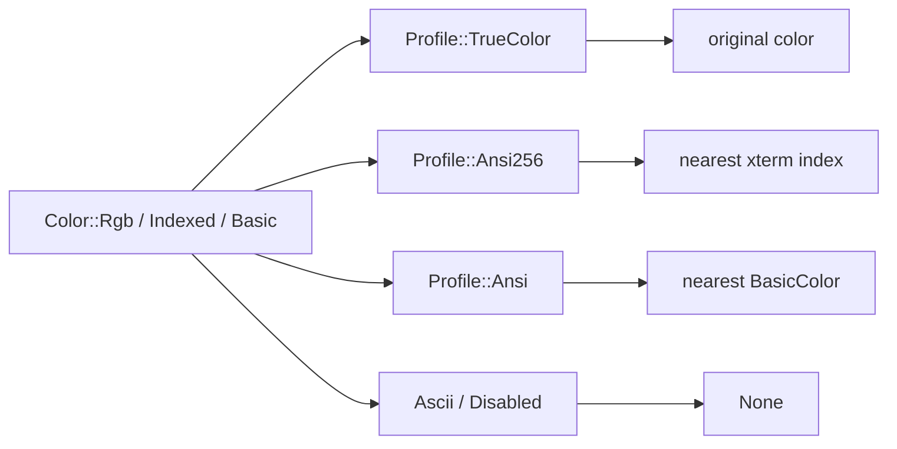

`Style` is the value uncurses uses for terminal text appearance. It stores
foreground, background, underline color, underline shape, boolean SGR
attributes, and an optional OSC 8 hyperlink.

See the [style rustdoc](../api/uncurses/style/) and
[color rustdoc](../api/uncurses/color/) for exact types, and
[Canvas and rendering]() for how styles
are diffed frame-to-frame.

## Style as a value

Build styles fluently and pass the resulting value around:

```rust
use uncurses::color::{BasicColor, Color};
use uncurses::style::{Style, UnderlineStyle};

let heading = Style::default()
    .bold()
    .italic()
    .underline_style(UnderlineStyle::Curly)
    .underline_color(BasicColor::BrightCyan)
    .fg(Color::Rgb(255, 128, 0))
    .bg(BasicColor::Black);
```

Builder methods take and return `Self`, so you can compose styles and clone
them into cells, spans, or examples without borrowing state.

## Rendering: opener or wrapped span

There are two rendering modes:

| API | Emits | Reset? | Hyperlink? |
| --- | --- | --- | --- |
| `Style::write(&mut w)` / `Display for Style` | SGR opener (`CSI … m`), then OSC 8 start when `link` is set | No | Opens only |
| `Style::write_styled(&mut w, text)` / `Style::styled(text)` | SGR opener, optional OSC 8 start, text, optional OSC 8 end, SGR reset | Yes | Yes, when `link` is set |

An empty style is the reset sequence (`CSI m`). That makes the opener pattern
from the `styles` example straightforward:

```rust
use std::io::{self, Write};

use uncurses::color::BasicColor;
use uncurses::style::Style;

fn main() -> io::Result<()> {
    let mut out = io::stdout().lock();
    let open = Style::default().bold().fg(BasicColor::Green);
    let reset = Style::default();

    writeln!(out, "{open}text{reset}")?;
    writeln!(out, "{}", open.styled("wrapped text"))?;
    open.write_styled(&mut out, "also wrapped")?;
    writeln!(out)?;

    Ok(())
}
```

Use the bare opener when you are managing the close yourself or writing a run of
text with ordinary formatting. Use `styled()` or `write_styled()` when you want a
self-contained span that cannot leak SGR state into later output.

## Attributes and underline

Boolean attributes live in `AttrFlags` and are exposed as builder methods:

| Builder | SGR attribute |
| --- | --- |
| `bold()` | Bold/intense |
| `faint()` | Faint/decreased intensity |
| `italic()` | Italic |
| `blink()` | Slow blink |
| `rapid_blink()` | Rapid blink |
| `reverse()` | Reverse video |
| `conceal()` | Conceal |
| `strikethrough()` | Strikethrough |

Underline shape is separate because SGR has multiple underline variants:

| Builder / value | Encoding |
| --- | --- |
| `underline()` or `UnderlineStyle::Single` | `4` |
| `UnderlineStyle::Double` | `4:2` |
| `UnderlineStyle::Curly` | `4:3` |
| `UnderlineStyle::Dotted` | `4:4` |
| `UnderlineStyle::Dashed` | `4:5` |
| `underline_color(color)` | `58:5:n` or `58:2::r:g:b` |

Use `underline_style(UnderlineStyle::None)` to clear the shape on a style value,
and `underline_color(None)` to clear its underline color.

## SGR anatomy

Style emission combines the active SGR state into one `CSI … m` sequence:

```text
ESC [   1 ;   4:3  ;    38;2;255;128;0  ; 58:2::0:255:255     m
└─┬─┘ └─────────────── SGR parameters ─────────────────────┘ └┬┘
 CSI  attrs  underline   fg truecolor     ul color          final
```

Standard colors use `30`-`37` / `40`-`47`, bright colors use `90`-`97` /
`100`-`107`, indexed colors use `38;5;n` / `48;5;n`, true color uses
`38;2;r;g;b` / `48;2;r;g;b`, and underline color uses colon subparameters.

## Color values

`Color` has three representations:

| Variant | Meaning |
| --- | --- |
| `Color::Basic(BasicColor)` | The 16-color ANSI palette. |
| `Color::Indexed(u8)` | An xterm 256-color palette index. |
| `Color::Rgb(r, g, b)` | 24-bit true color. |

Helpers convert to and from common color formats:

```rust
use uncurses::color::{BasicColor, Color};
use uncurses::style::Style;

let short = Color::hex("#fff").unwrap();
let full = Color::hex("#ffffff").unwrap();
let alpha_ignored = Color::hex("#ffffffaa").unwrap();
let from_hsl = Color::hsl(210.0, 0.65, 0.45);

assert_eq!(short.to_hex(), "#ffffff");
let (_h, _s, _l) = from_hsl.to_hsl();

let style = Style::default()
    .fg(full)
    .bg(BasicColor::Black)
    .underline_color(Some(alpha_ignored))
    .underline_color(None);
```

`Color::hex` accepts `#rgb`, `#rrggbb`, and `#rrggbbaa` forms, with the leading
`#` optional. The alpha byte in the eight-digit form is parsed for validity and
then ignored because terminal colors have no alpha channel.

The color setters `fg`, `bg`, and `underline_color` accept
`impl Into<Option<Color>>`: pass a `Color`, a `BasicColor`, `Some(color)`, or
`None`. Passing `None` clears that field on the style value.

## Graceful downsampling

The renderer writes styles once and converts colors to the active
`Profile`. True-color terminals keep exact RGB; lower profiles quantize to the
nearest supported palette or drop color.



`Profile::Disabled` emits no styling output. `Profile::Ascii` drops colors but
can still preserve non-color text decoration at higher layers. `Ansi` and
`Ansi256` use weighted RGB distance to choose the nearest palette entry.

The `gradient` example leans on this: it draws with `Color::hsl` / true color,
and the same code degrades to 256-color, 16-color, or no color depending on the
terminal profile.

## OSC 8 hyperlinks

`Style::link(url, params)` attaches an OSC 8 hyperlink. A non-empty URL stores
the link; an empty URL clears it. The opener (`Display for Style` /
`Style::write`) emits the OSC 8 start after the SGR sequence, but it cannot
close the link on its own, so use `styled()` or `write_styled()` when you want
the whole span, open and close, emitted automatically.

```rust
use uncurses::color::BasicColor;
use uncurses::style::Style;

let docs = Style::default()
    .underline()
    .fg(BasicColor::BrightBlue)
    .link("https://github.com/aymanbagabas/uncurses", "");

println!("{}", docs.styled("uncurses on GitHub"));
```

The emitted order is SGR opener, OSC 8 start, text, OSC 8 end, SGR reset. The
hyperlink and SGR state are closed in reverse order of opening, so the opener
and `write_styled` stay symmetric.
