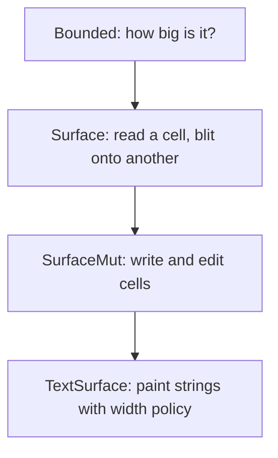

A [buffer]() is one kind of cell grid, but it is not
the only one. There are clipped views, off-screen windows, text buffers, render
buffers, and the live screen itself.
Drawing code should not care which one it is writing into. The *surface* traits
are the shared contract that makes that possible: write a widget once, and draw
it into any grid.

## A ladder of traits

Surfaces are described in layers, each one adding a capability to the last.



- **`Bounded`** answers the base question: what rectangle does this grid cover?
  It also provides `width` and `height`.
- **`Surface`** adds reading a cell and `draw`, which blits one surface onto
  another, keeping wide cells and their continuations intact.
- **`SurfaceMut`** adds writing: `set_cell`, mutable cell access, filling and
  clearing regions, line insertion and deletion, and cell insertion and
  deletion within a row.
- **`TextSurface`** adds the `set_str` family. It is the only layer that knows
  about [width](), so it segments graphemes and lays
  down wide primaries and continuations for you.

## Write once, draw anywhere

Because the traits are the contract, drawing code targets a trait instead of a
concrete type. A function that takes `&mut impl SurfaceMut` works on a plain
buffer, a clipped view, or the live screen without changing a line. That is the
whole point: your rendering logic is decoupled from where the pixels eventually
land.


By default, the `set_str` family paints text *literally*: an escape sequence in
your string is drawn as visible characters, not interpreted. To treat inline
SGR and hyperlinks as styling, wrap the surface in a `Painter`. The [Styling
text guide]() covers the difference.


## TextBuffer: paint and serialize, no terminal

`TextBuffer` is the session-free surface you reach for when there is no terminal
to manage. It wraps a buffer with a width policy and implements `TextSurface`,
so you can paint strings into it. It also implements `Encode`, so you can turn
the finished grid into escape bytes or a `String`. No renderer, no terminal, no
raw mode.

```rust
use uncurses::buffer::TextBuffer;
use uncurses::style::Style;
use uncurses::text::{Encode, TextSurface};

fn main() {
    let mut frame = TextBuffer::new(8, 1);
    frame.set_str((0, 0), "hi 世", Style::default());
    assert_eq!(frame.display().to_string(), "hi 世");
}
```

That makes it the right tool for one-shot frames, snapshot tests, transcripts,
and append-style output.

## Other grids

The same traits back a small family of grids. `Buffer` is the plain owned grid.
`Window` is an owned off-screen grid with a target position. `View` is a
clipped borrow over another surface, so you can hand a widget a sub-rectangle
and let it draw within those bounds. The widget still uses the wrapped surface's
coordinates; the view clips reads and writes, but does not translate them.
`RenderBuffer` adds dirty tracking for the renderer.

`TextBuffer` and `Screen` implement `TextSurface`, and `Painter` wraps a text
surface when inline SGR or OSC 8 should become style instead of literal text.
Those are the destinations where the `set_str` family works.

The most important surface of all is the live [Screen]():
you paint into it exactly like any other grid, and it takes care of getting the
changes onto the terminal.
