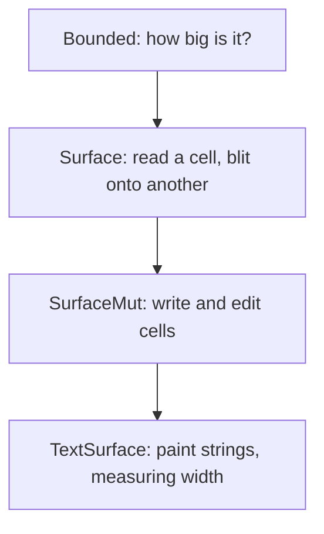

A [buffer]() is one kind of cell grid, but it is not
the only one. There are clipped views, single rows, and the live screen itself.
Drawing code should not care which one it is writing into. The *surface* traits
are the shared contract that makes that possible: write a widget once, and draw
it into any grid.

## A ladder of traits

Surfaces are described in layers, each one adding a capability to the last.



- **`Bounded`** answers the only question every grid must: what is its extent?
- **`Surface`** adds reading a cell and `draw`, which blits one surface onto
  another, keeping wide cells and their continuations intact.
- **`SurfaceMut`** adds writing: set a cell, fill or clear a region, insert and
  delete lines or columns.
- **`TextSurface`** adds painting whole strings. It is the only layer that knows
  about [width](), so it segments graphemes and lays
  down wide primaries and continuations for you.

## Write once, draw anywhere

Because the traits are the contract, drawing code targets a trait instead of a
concrete type. A function that takes `&mut impl SurfaceMut` works on a plain
buffer, a clipped view, or the live screen without changing a line. That is the
whole point: your rendering logic is decoupled from where the pixels eventually
land.


By default the `set_str` family paints text *literally*: an escape sequence in
your string is drawn as visible characters, not interpreted. To treat inline
SGR and hyperlinks as styling, paint through a `Painter`. The Styling page
covers the difference.


## TextBuffer: paint and serialize, no terminal

`TextBuffer` is the stateless surface you reach for when there is no session to
manage. It is a buffer plus a width policy that implements `TextSurface`, so you
can paint strings into it, and `Encode`, so you can turn the finished grid into
escape bytes or a `String`. No renderer, no terminal, no raw mode.

```rust
use uncurses::buffer::TextBuffer;
use uncurses::style::Style;
use uncurses::text::{Encode, TextSurface};

fn main() {
    let mut frame = TextBuffer::new(8, 1);
    frame.set_str((0, 0), "hi 世", Style::default());
    assert_eq!(frame.display().to_string(), "hi 世");
}
```

That makes it the right tool for one-shot frames, snapshot tests, transcripts,
and append-style output.

## Other grids

The same traits back a small family of grids. `Window` is an owned off-screen
grid you compose into. `View` is a clipped, borrowed window onto another
surface, so you can hand a widget a sub-rectangle and let it draw within those
bounds. `Line` is a single row of cells. All of them are surfaces, so the same
fill, draw, and paint operations work everywhere.

The most important surface of all is the live [Screen]():
you paint into it exactly like any other grid, and it takes care of getting the
changes onto the terminal.
