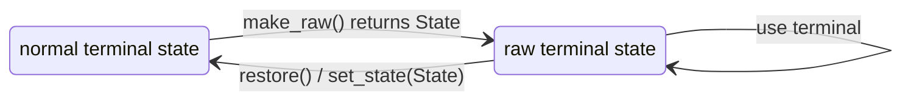
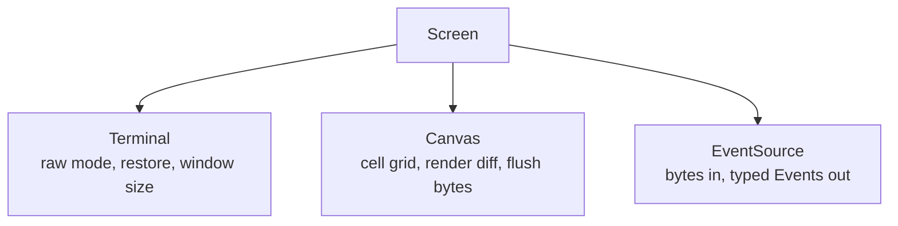

`Terminal<I, O>` is the low-level handle over a terminal input half and output
half. It implements `Read` by delegating to `I`, implements `Write` by delegating
to `O`, keeps an environment snapshot, and owns one optional saved raw-mode
state.

Most applications use [Screen](), which owns this
layer for you. Use `Terminal` directly when you are wiring a `Canvas` and
`EventSource` by hand, as in the `low_level` example.

## Choosing handles

`Terminal::stdio()` builds a `Terminal<Stdin, Stdout>` over the process's
inherited standard input and output:

```rust
let mut term = uncurses::terminal::Terminal::stdio();
```

Use it when the process is expected to be connected directly to the terminal.

`Terminal::open()` opens the controlling terminal directly:

```rust
let mut term = uncurses::terminal::Terminal::open()?;
```

On Unix, that opens `/dev/tty` for both halves. On Windows, input comes from
`CONIN$` and output goes to `CONOUT$`. This is the right path when stdin or
stdout may be redirected but the program still needs to control the user's
terminal.

## Raw-mode lifecycle

Raw mode is a save, apply, restore lifecycle. `make_raw()` snapshots the prior
state, applies raw mode, stores that prior state inside the `Terminal`, and
returns a clone. `restore()` takes no arguments: it applies and clears the saved
state, or does nothing when no state is saved.



```rust
use uncurses::terminal::Terminal;

fn main() -> std::io::Result<()> {
    let mut term = Terminal::stdio();
    let saved = term.make_raw()?;
    let _ = saved;

    // read and write terminal bytes here

    term.restore()
}
```

The lower-level free functions expose the same pieces when you manage handles
and state yourself:

| API | Role |
| --- | --- |
| `get_state(input, output)` | Snapshot the current terminal state without changing it. |
| `make_raw_mode(input, output)` | Snapshot the current state, apply raw mode, and return the previous `State`. |
| `set_state(input, output, &state)` | Apply a previously saved state. |

There is no `Drop` restoration. If you enter raw mode directly, restore it
explicitly.

## Window size

`Terminal::get_window_size()` asks the operating system for the current window
dimensions and returns a `Winsize`:

```rust
let size = term.get_window_size()?;
let width = size.col;
let height = size.row;
let pixels = (size.xpixel, size.ypixel);
```

`row` and `col` are cell dimensions. `xpixel` and `ypixel` are pixel dimensions
when the platform reports them, or `0` when unknown. On Unix, the terminal tries
the output descriptor first and falls back to input. On Windows, it queries the
output console screen buffer.

## Where it fits

`Terminal` does not render cells and does not decode input events. It is the
thin tty layer underneath the rest of uncurses:



If you use `Screen::stdio()` or `Screen::open()`, `Screen::init()` calls
`Terminal::make_raw()` and `Screen::finish()` calls `Terminal::restore()` for
you.
