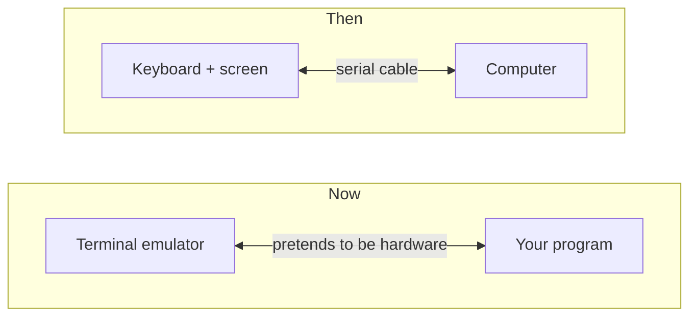
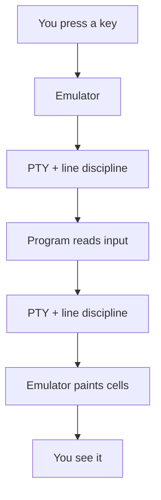
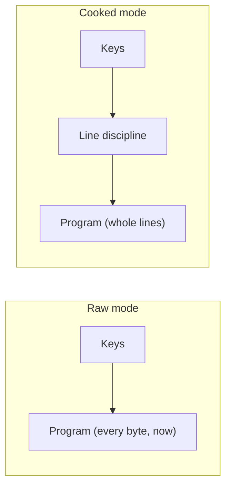

"Terminal" is an overloaded word. It was once a real piece of hardware. Today
it is usually a *terminal emulator*, a program pretending to be that hardware,
with a surprising amount of machinery in between. Here is the path from a
keypress to a character on screen, and where uncurses plugs in.

## Then and now

A terminal used to be hardware: a keyboard and display wired to a host computer
by a serial cable. It shipped your keystrokes down the wire and
painted whatever came back, obeying coded messages called escape sequences.
Today it is a terminal emulator: a program that draws a grid of cells and
pretends to be that old hardware. The hardware terminal is mostly gone, but its
byte language remains.



## The tty and pty

Your program and the emulator never talk directly. The kernel sits between them
as the *tty*, which is not a dumb pipe: it has a small line editor baked in, the
*line discipline*. In its default *cooked* mode it edits your line as you type,
echoes keystrokes, waits for Enter, and turns Ctrl-C into an interrupt signal.
When everything is software, that tty is a *pseudo-terminal* (PTY): a
kernel-provided master/slave pair. The emulator holds the master; your program
sees the slave as a normal terminal device.



Both directions are buffered. Keystrokes can queue before they reach you;
printed bytes can queue before they get painted. Writing to a terminal does not
mean the pixels changed yet, so you decide when to flush.

## Cooked vs raw

An interactive program usually wants the tty out of the way: every keystroke as
it happens, with arrow keys, Ctrl-C, and pasted bytes delivered as input bytes.
So it flips the tty into *raw* mode, telling the line discipline to step aside.



The trade-off: you inherit every job the tty did for free, from echoing to
handling Ctrl-C. The one rule is etiquette. Raw mode is a global change to a
shared device, so it is borrowed, not owned: turn it on when you start, and put
everything back on the way out.

## The Terminal handle

In uncurses, that borrow-and-restore flow starts with the
[`terminal`](/api/uncurses/terminal/index.html) module's `Terminal` handle. It
pairs input and output handles, snapshots the environment, and caches the
pre-raw state returned by `make_raw` so `restore` can re-apply it:

```rust
use uncurses::terminal::Terminal;

fn main() -> std::io::Result<()> {
    let mut term = Terminal::stdio();
    term.make_raw()?;                 // borrow raw mode from the tty
    let size = term.get_window_size();
    term.restore()?;                  // hand the tty back exactly as we found it
    let size = size?;
    println!("{} x {}", size.col, size.row);
    Ok(())
}
```

Most apps never touch `Terminal` directly. [`Program`]()
manages the session lifecycle: `init()` borrows raw mode, `finish()` restores
the terminal, and `pause()` / `resume()` temporarily hand it away and take it
back. [`Screen`]() is the renderer inside the program,
generic over one writer type `W: Write`; it does not own the tty lifecycle.
Reach for `Terminal::stdio` or `Terminal::open` only when you want the raw
connection yourself.

## Going deeper

The mechanics, for the curious:
[termios(3)](https://man7.org/linux/man-pages/man3/termios.3.html),
[pty(7)](https://man7.org/linux/man-pages/man7/pty.7.html),
[line discipline](https://en.wikipedia.org/wiki/Line_discipline),
[pseudoterminal](https://en.wikipedia.org/wiki/Pseudoterminal),
[Windows console modes](https://learn.microsoft.com/en-us/windows/console/console-modes).
