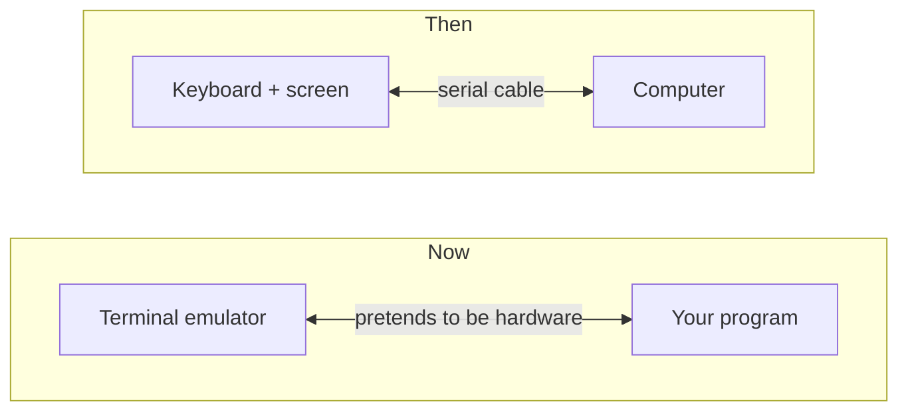
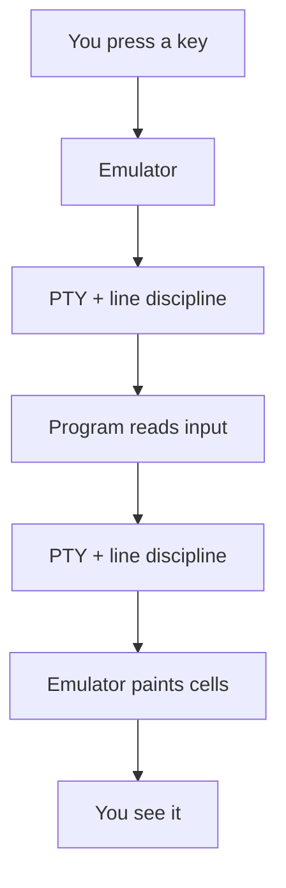
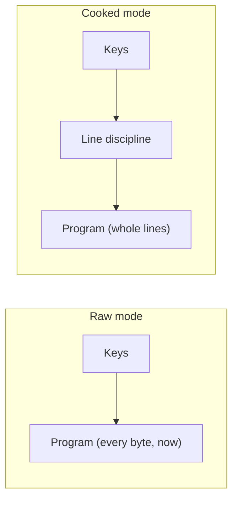

"Terminal" is an overloaded word. It was once a real piece of hardware, today
it is a *terminal emulator*, a program pretending to be that hardware, and
there is a surprising amount of machinery wedged in between. Here is the whole
picture between a keypress and a character on screen, and where uncurses plugs
in.

## Then and now

A terminal used to be hardware: a keyboard bolted to a screen, wired to a big
computer by a serial cable. It shipped your keystrokes down the wire and
painted whatever came back, obeying coded messages called escape sequences.
Today it is a terminal emulator: a program that draws a grid of cells and
pretends to be that old hardware. The hardware is gone, but its byte language
never left.



## The tty and pty

Your program and the emulator never talk directly. The kernel sits between them
as the *tty*, which is not a dumb pipe: it has a tiny text editor baked in, the
*line discipline*. In its default *cooked* mode it edits your line as you type,
echoes keystrokes, waits for Enter, and turns Ctrl-C into a quit signal. When
everything is software, that tty is a *pseudo-terminal* (PTY): a matched pair of
ends the kernel hands out, the emulator holding one and your program the other,
dressed up to look exactly like a real device.



Both directions are buffered. Keystrokes pile up before they reach you; printed
bytes queue before they get painted. Writing to a terminal does not mean the
pixels changed yet, so you decide when to flush.

## Cooked vs raw

An interactive program wants none of the hand-holding: every keystroke the
instant it happens, arrow keys, Ctrl-C, and pasted bytes included. So it flips
the tty into *raw* mode, telling the line discipline to step aside.



The trade: you inherit every job the tty did for free, from echoing to handling
Ctrl-C. The one rule is etiquette. Raw mode is a global change to a shared
device, so it is borrowed, not owned: switch in on the way up, and put
everything back on the way out.

## The Terminal handle

In uncurses that borrow-and-restore lives on the [`terminal`](/api/uncurses/terminal/index.html)
module's `Terminal`. It pairs an input and output half, snapshots the
environment, and owns the raw-mode state so you do not have to track it:

```rust
use uncurses::terminal::Terminal;

fn main() -> std::io::Result<()> {
    let mut term = Terminal::stdio();
    term.make_raw()?;                 // borrow raw mode from the tty
    let size = term.get_window_size()?;
    println!("{} x {}", size.col, size.row);
    term.restore()?;                  // hand the tty back exactly as we found it
    Ok(())
}
```

Most apps never touch this directly. [Screen]() opens
the terminal, borrows raw mode, and restores it for you as part of its
lifecycle. Reach for `Terminal` when you want the raw connection without the
rest of the facade.

## Going deeper

The mechanics, for the curious:
[termios(3)](https://man7.org/linux/man-pages/man3/termios.3.html),
[pty(7)](https://man7.org/linux/man-pages/man7/pty.7.html),
[line discipline](https://en.wikipedia.org/wiki/Line_discipline),
[pseudoterminal](https://en.wikipedia.org/wiki/Pseudoterminal),
[Windows console modes](https://learn.microsoft.com/en-us/windows/console/console-modes).
