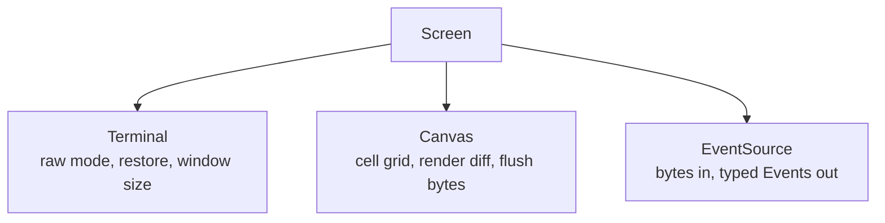

uncurses is a low-level terminal library, not a terminal UI framework. It gives
you the pieces: a cell grid with a diffing renderer, typed input decoding, ANSI
helpers, and a terminal handle. You own the event loop and decide when bytes hit
the wire.

See [The four layers]() for the
orientation, [The Screen facade]() for the
high-level lifecycle, and the [API reference](../../../api/) for exact types.

## Layered, not a framework

`Screen` is the convenient top layer:



It owns a `Terminal`, a `Canvas`, and an `EventSource`. It also tracks input and
terminal modes so they can be torn down for the shell and restored later.


Use the highest layer that fits. When you outgrow it, drop a layer: drive
`Canvas` directly, read from `EventSource` yourself, or emit a specific sequence
through `ansi`.


That shape is intentional. A framework would own the event loop, widget tree,
global state, and rendering policy. uncurses keeps those decisions at the edges
of your application. The low-level pieces remain useful for snapshot tests,
input-only tools, alternate render loops, and integrations that need terminal
bytes but not a full application facade.

## Infallible to draw, fallible to flush

Drawing methods write to memory. The renderer stages bytes into an internal
buffer. Nothing reaches the underlying writer until you flush.

```rust
screen.set_str((0, 0), "Hello", Style::default());
screen.present()?;
```

The first line is ordinary drawing into a cell buffer. The second line is the I/O
boundary: `present()` renders the diff and flushes it.


There is one honest output error site: `flush()` or a helper that calls it, such
as `present()`. The hot draw path has no fake `Result` values to thread through
your UI code.


This matches the real failure mode. Setting a `Cell` cannot lose a terminal
connection. Writing staged bytes to a terminal, pipe, socket, or test sink can.
For the byte-level path behind this split, read [The rendering pipeline]().

## Modern terminals, directly

The crate philosophy in `lib.rs` and the READMEs is explicit: no terminfo
database, no compatibility matrix for terminals that stopped shipping decades
ago, no widget tree, and no hidden global state.

uncurses assumes a modern VT100/xterm-compatible terminal and talks to it
straight. `Optimizations` still gates renderer byte choices such as erase
characters, repeat characters, insert/delete lines, scroll regions, tabs,
absolute column moves, and line-discipline assumptions. But that is a renderer
contract for which equivalent byte sequences are safe to use; it is not an
attempt to emulate every historical terminal.

See [How terminals work]() for the byte-stream model.

## No probing behind your back

Low-level APIs emit what you ask them to emit. They do not quietly run a blocking
probe, consult terminfo, or rewrite your program around a hidden compatibility
database.


Feature detection is the host application's responsibility. If a feature matters,
ask the terminal and handle the reply; otherwise emit the sequence and let
unsupported terminals ignore or degrade it.


You can still ask. Queries are normal terminal I/O: write a request, flush it,
and read the reply from the same event stream as keys, mouse input, paste, focus,
and resize reports. `Screen::init()` stages its startup queries, then observes
replies as they pass through `read_event`, `try_read_event`, or the async event
stream. `Screen::capabilities()` is a snapshot of what has been learned so far,
not a hidden blocking probe on every draw.

For details, see [Capabilities and queries]().

## Explicit lifecycle, no `Drop` magic

Terminal state is global and sticky. Raw mode, alternate screen, mouse tracking,
bracketed paste, focus reports, cursor style, and related modes survive until
somebody turns them off. Hiding that cleanup in `Drop` would make error reporting
ambiguous and teardown order implicit.

`Screen` construction is inert. A session is bracketed explicitly:

```rust
let mut screen = Screen::open()?;
screen.init()?;

// draw, flush, and read events

screen.finish()?;
```

There are also explicit handoff methods:

| Method | Purpose |
| --- | --- |
| `finish(self)` | consume the screen, reset tracked modes, flush, and restore the terminal |
| `pause(&mut self)` | temporarily hand the terminal back to the shell without consuming the screen |
| `resume(&mut self)` | re-enter raw mode, restore modes, invalidate the canvas, and repaint |
| `suspend(&mut self)` | on Unix, pause and raise `SIGTSTP`; call `resume()` after foregrounding |

The same principle applies when you drive lower layers yourself: reset the modes
you enabled, flush the staged bytes, then restore the terminal state you changed.

## Graceful color and feature degradation

uncurses exposes modern terminal features, but the rendering path is designed to
fall back cleanly when a capability is not available or not enabled.

Color is the clearest example. A `Style` stores the color the application wants.
The renderer converts it through the active color `Profile` when emitting SGR:
true color stays exact, 256-color and 16-color profiles downsample, and disabled
profiles drop styling output. OSC 8 hyperlinks are suppressed when the converted
style has no link.

Renderer optimizations follow the same shape. If `REP` is disabled, repeated
ASCII runs are emitted plainly. If `CHT` or hardware tabs are unavailable, the
cursor planner falls back to CUF/CUB or other safe moves. If scroll operations
are not enabled or not cost-effective, rows are repainted cell by cell. The
intended cell result is the contract; shorter byte sequences are optional.

See [Styling and color]() and
[Canvas and rendering]() for
how those choices surface in the public API.

## The shape in one sentence


uncurses keeps terminal programming explicit: choose your layer, draw
infallibly, flush deliberately, ask for capabilities when you need them, and
restore what you changed.

