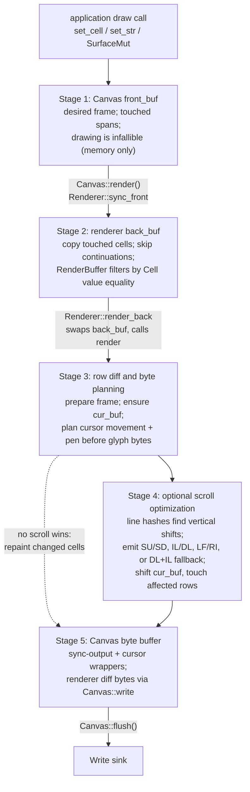
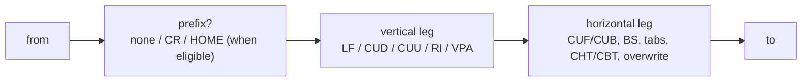

This page follows one write from a `set_cell` or `set_str` call to the bytes
uncurses eventually sends to a terminal. The short version is: drawing updates an
in-memory desired frame, `render()` plans the terminal diff, and `flush()` is the
only place bytes touch the `Write` sink.

For the public `Canvas` API, start with [Canvas and rendering]().
For the raw API surface, see the [API reference](/api/).

## The whole pipeline

`Canvas::present()` is `Canvas::render()` followed by `Canvas::flush()`.

## Stage 1: writes land in the desired frame

`Canvas<W>` owns a `front_buf: RenderBuffer`. This is the frame the application
wants, not necessarily what the terminal currently shows. Text and surface APIs
write `Cell` values into that buffer and mark per-row touched spans.

`RenderBuffer::set_cell` compares the new cell against the existing cell before
marking a span. If the value is identical, there is no touch. If a wide cell is
replaced by a narrower cell, the touched range expands to cover stale
continuation columns.

The important consequence is that drawing has no I/O boundary. The draw path
mutates a buffer and returns normally; it does not call the terminal, and it has
no `io::Error` to report.


Drawing is infallible because it writes only into uncurses-owned memory. The
honest error site is `flush()`, where staged bytes are written to the underlying
`Write` sink.


## Stage 2: `render()` filters real changes by value

`Canvas::render()` starts with `Renderer::sync_front(&mut front_buf)`. That sync
walks only touched spans from the front buffer. It skips wide-cell continuation
columns and advances by each primary cell's width.

For each primary cell it calls `RenderBuffer::set_cell` on the renderer's
`back_buf`. That is another value-equality filter: if the desired `Cell` equals
the staged cell already in `back_buf`, it is not marked touched for the renderer.
Bulk operations can touch a whole row in the front buffer, but identical values
still disappear here before terminal bytes are planned.

After sync, `front_buf`'s touched flags are cleared. If `back_buf` has no real
changes and no forced clear is pending, `render()` returns without staging frame
bytes.

## Stage 3: row diff, cursor movement, and pen state

The renderer keeps `cur_buf`, its model of what it believes is on screen. During
`Renderer::render`, `prepare_frame` ensures that model exists, handles resizes,
updates the width-specific tab-stop table, and consumes pending force clears. A
forced clear emits the layout-appropriate clear first, then marks the new buffer
fully touched so the ordinary row diff repaints the frame after the clear.

After preparation, `diff_frame` walks touched rows and calls `transform_line`. The
touched flag gates which rows to consider, but `transform_line` scans the full row
against `cur_buf`. That matters because scroll optimization may have changed
`cur_buf` outside the original touched span.

Inside a row, the renderer looks for the first and last meaningful differences
and chooses among explicit glyph writes, erase-to-end/left, erase-character,
repeat-character, insert/delete-cell paths, and plain overwrites. It updates
`cur_buf` as bytes are emitted so the tracked screen remains aligned with the
terminal effect.

Before emitting a changed run, the renderer moves the cursor. Movement is planned
by byte cost before bytes are materialized:

In absolute mode, a long-distance or unknown-position move emits `CUP` directly.
For local absolute moves, `CUP` competes against relative shapes and wins ties.
In relative mode, the planner considers prefixes such as none and carriage
return, then chooses a vertical leg and a horizontal leg.

Horizontal planning is controlled by the active `Optimizations`:

- `TABS` allows literal tab bytes;
- `CHT` / `CBT` allow cursor-forward/backward-tab CSI sequences;
- `BS` allows literal backspace for cursor-left;
- `CHA`, `HPA`, and `VPA` allow absolute axis moves;
- CUF/CUB remain the conservative horizontal fallback when shorter options are
  not enabled or do not win on byte cost.

The tab-stop planner is deliberately precise near the right edge. `TabStops`
keeps both a clamped `next()` and an unclamped `next_stop()`. Forward cursor
planning uses the unclamped `next_stop()`, which models the true terminal tab
advance even when it would land past the canvas edge. A tab is counted only while
that true stop is at or before the target column, so the renderer never chooses a
tab that would overshoot and then pretend it landed on the right edge.

Style is handled separately from cursor position. The renderer tracks the active
pen as a `Style`. `update_pen` first checks raw style equality; if the target cell
already matches the current pen, it emits nothing. Otherwise it writes only the
SGR diff needed after color-profile conversion, and opens or closes OSC 8
hyperlinks only when the hyperlink state changes. At frame end, the pen is reset
through the same diff path, so the reset is skipped when the terminal is already
at the default style.

## Stage 4: scroll detection can replace repainting

When fullscreen rendering has enough touched rows for the work to pay off, the
renderer computes content hashes for old and new rows. The scroll detector builds
`oldnum`, a map from each new row to the old row with matching content, then
grows unique matches into contiguous hunks. Small or wasteful hunks are rejected.

Each accepted hunk is applied as a terminal scroll operation instead of repainting
the moved rows cell by cell. The dispatcher tries, in order:

1. direct scrolling where the region lines up with the screen edge;
2. a DECSTBM scroll region, then the same direct operation inside that region;
3. a delete-lines plus insert-lines fallback.

The byte sequences involved are the terminal's vertical editing primitives:

| Direction | Preferred operations |
| --- | --- |
| content moves up | `SU`, `DL`, or `LF` at a scroll boundary |
| content moves down | `SD`, `IL`, or `RI` at a scroll boundary |
| partial-region fallback | paired `DL(n)` and `IL(n)` |

After a scroll byte is emitted, `cur_buf` is shifted to match what the terminal
should have done, rows affected by the scroll are touched, and row hashes are
updated. The later row transform only patches what still differs.

## Stage 5: `flush()` and `present()`

`Canvas::render()` only appends bytes to `Canvas::buf`. The buffer may contain:

- frame diff bytes from the renderer;
- synchronized-output begin/end markers when that mode is enabled;
- temporary cursor hide/show bytes while rendering;
- raw bytes written through the `Canvas` implementation of `std::io::Write`.

`Canvas::flush()` drains that staged buffer into the owned writer with
`write_all`, clears the staging buffer, and then calls the writer's `flush()`. If
anything fails, this is where the `io::Error` appears.

`Canvas::present()` is the convenience boundary: it calls `render()` and then
`flush()`. A no-op frame stages no render bytes, but `present()` still flushes the
underlying writer because that is the explicit I/O boundary.

## Keep going

- [Design principles]() explains why the API is shaped around this boundary.
- [Styling and color]() covers color profiles and graceful downsampling.
- [Capabilities and queries]() explains how applications ask terminals what they support.
