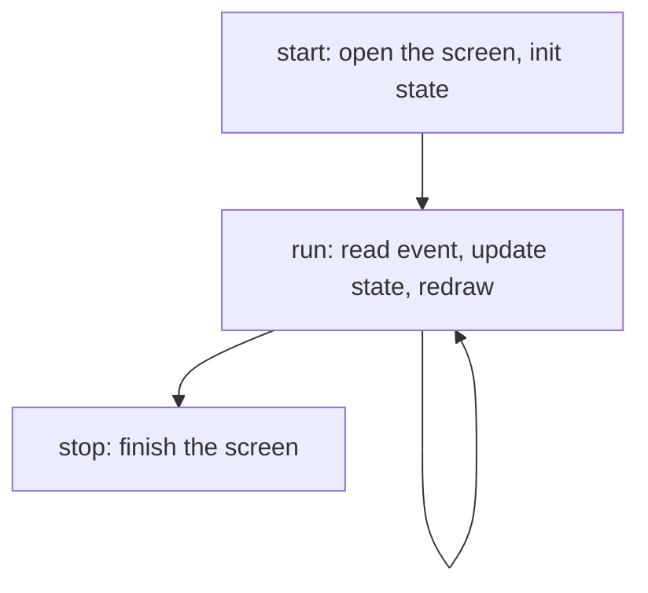

Time to put it together. We will build a small interactive counter: a number you
nudge up and down with the arrow keys, reset with `r`, and quit with `q`. It is
tiny, but it has every moving part a real app has: a session, some state, a draw
function, and an event loop.

## The shape of an app

Almost every uncurses app follows the same four-beat structure. A type that owns
the screen and the app state, a setup step, a loop, and a teardown step.



We will hang those four beats off a single `App` struct.

## Setting up

`start` opens the screen, takes over the full terminal, and seeds the counter at
zero. It also parses the quit keys once, up front, so the loop can compare
against them cheaply.

```rust
use uncurses::color::BasicColor;
use uncurses::event::{Event, Key};
use uncurses::screen::Screen;
use uncurses::style::Style;
use uncurses::terminal::{Stdin, Stdout};
use uncurses::buffer::SurfaceMut;
use uncurses::text::TextSurface;

struct App {
    screen: Screen<Stdin, Stdout>,
    count: i64,
    quit: [Key; 2],
}

impl App {
    fn start() -> std::io::Result<Self> {
        let mut screen = Screen::stdio()?;
        screen.init()?;
        screen.enter_alt_screen()?;
        screen.hide_cursor()?;
        Ok(Self {
            screen,
            count: 0,
            quit: ["q", "ctrl+c"].map(|s| s.parse().unwrap()),
        })
    }
}
```

`Key` parses from strings, so `"q"` and `"ctrl+c"` become real chords with no
ceremony. We hold them in an array and ask `contains` later.

## Drawing a frame

`render` paints the whole frame from scratch every time: clear the grid, write
the title, the value, and a hint line, then push it with one `render` call.
Painting is cheap and the renderer only sends the cells that actually changed, so
"redraw everything" is the right default.

```rust
impl App {
    fn render(&mut self) -> std::io::Result<()> {
        self.screen.clear();

        let title = Style::default().bold().fg(BasicColor::BrightCyan);
        self.screen.set_str((2, 1), "Counter", title);

        let value = Style::default().bold();
        self.screen
            .set_str((2, 3), &format!("count: {}", self.count), value);

        let hint = Style::default().fg(BasicColor::BrightBlack);
        self.screen
            .set_str((2, 5), "up/down: change   r: reset   q: quit", hint);

        self.screen.render()
    }
}
```

## The event loop

`run` draws once, then blocks on `read_event` and reacts. Arrows change the
count, `r` resets it, a resize re-lays-out, and a quit key breaks the loop. We
only redraw when something actually changed.

```rust
impl App {
    fn run(&mut self) -> std::io::Result<()> {
        self.render()?;

        let up: Key = "up".parse().unwrap();
        let down: Key = "down".parse().unwrap();
        let reset: Key = "r".parse().unwrap();

        loop {
            match self.screen.read_event()? {
                Event::KeyPress(ref k) if self.quit.contains(k) => break,
                Event::KeyPress(ref k) if *k == up => self.count += 1,
                Event::KeyPress(ref k) if *k == down => self.count -= 1,
                Event::KeyPress(ref k) if *k == reset => self.count = 0,
                Event::Resize(ws) => self.screen.resize((ws.col, ws.row)),
                _ => continue,
            }
            self.render()?;
        }
        Ok(())
    }
}
```

The `continue` on the catch-all arm skips the redraw for events we ignore, so the
terminal only repaints when the frame would actually differ.

## Putting the terminal back

`stop` consumes the app and finishes the screen, restoring the terminal exactly
as it was. `main` wires the three beats together, and crucially runs `stop` even
when `run` returned an error, so a crash mid-loop never leaves the terminal in a
weird state.

```rust
impl App {
    fn stop(self) -> std::io::Result<()> {
        self.screen.finish()
    }
}

fn main() -> std::io::Result<()> {
    let mut app = App::start()?;
    let result = app.run();
    app.stop()?;
    result
}
```

That ordering matters: bind the loop result, tear down, then return the result.
If you bubble up the error before `stop`, the terminal stays in raw mode and your
shell prompt comes back garbled.

## Where to go next

That is a complete, well-behaved terminal app in under a hundred lines. From
here:

- Add mouse support by initializing with mouse tracking, then matching on
  `Event::MouseClick`.
- Lay widgets out by reading `screen.width()` and `screen.height()` and doing the
  arithmetic, the way the `counter` example centers a button.
- Browse the [examples](https://github.com/aymanbagabas/uncurses/tree/main/examples/examples)
  for editors, file explorers, inline prompts, and more.
- Dig into the [Concepts]() to understand
  cells, surfaces, width, and the event model in depth.
