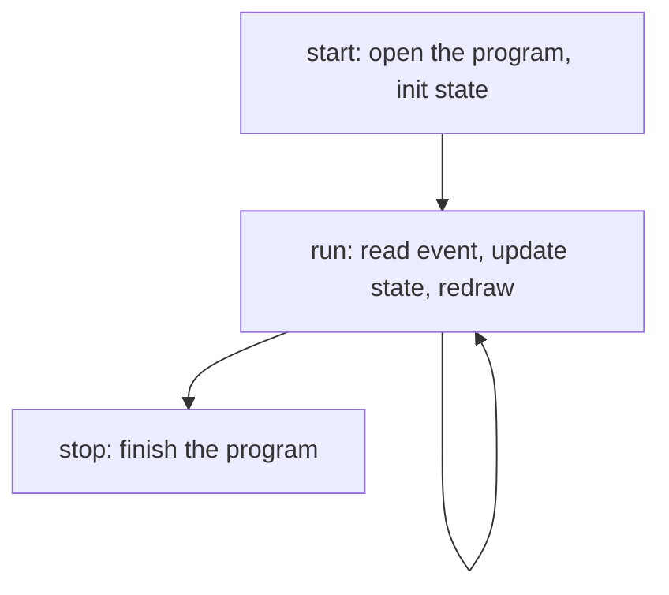

Time to put it together. We will build a small interactive counter: a number you
nudge up and down with the arrow keys, reset with `r`, and quit with `q`. It is
tiny, but it has every moving part a real app has: a session, some state, a draw
function, and an event loop.

## The shape of an app

Almost every uncurses app follows the same four-beat structure: a type that owns
the program and app state, a setup step, a loop, and a teardown step.



We will hang those four beats off a single `App` struct. The snippets below are
fragments from one complete file.

## Setting up

`start` opens the program, takes over the full terminal, and seeds the counter
at zero.

```rust
use uncurses::buffer::SurfaceMut;
use uncurses::color::Color;
use uncurses::event::Event;
use uncurses::program::Program;
use uncurses::style::Style;
use uncurses::terminal::{Stdin, Stdout};
use uncurses::text::TextSurface;

struct App {
    program: Program<Stdin, Stdout>,
    count: i64,
}

impl App {
    fn start() -> std::io::Result<Self> {
        let mut program = Program::stdio()?;
        program.init()?;
        program.enter_alt_screen()?;
        program.hide_cursor()?;
        Ok(Self { program, count: 0 })
    }
}
```

Key matching accepts strings, so the loop can ask whether a key matches `"q"` or
`"ctrl+c"` directly.

## Drawing a frame

`render` paints the whole frame from scratch every time: clear the grid, write
the title, the value, and a hint line, then push it with one `render` call on the
program's `Screen`. Painting is cheap and the renderer only sends the cells that
actually changed, so "redraw everything" is the right default.

```rust
impl App {
    fn render(&mut self) -> std::io::Result<()> {
        let screen = self.program.screen_mut();
        screen.clear();

        let title = Style::default().bold().fg(Color::BrightCyan);
        screen.set_str((2, 1), "Counter", title);

        let value = Style::default().bold();
        screen.set_str((2, 3), &format!("count: {}", self.count), value);

        let hint = Style::default().fg(Color::BrightBlack);
        screen.set_str((2, 5), "up/down: change   r: reset   q: quit", hint);

        screen.render()
    }
}
```

## The event loop

`run` draws once, then blocks on `read_event` and reacts. Arrows change the
count, `r` resets it, a resize updates the screen size, and a quit key breaks
the loop. We only redraw when something actually changed.

```rust
impl App {
    fn run(&mut self) -> std::io::Result<()> {
        self.render()?;

        loop {
            let ev = self.program.read_event()?;

            match ev {
                Event::KeyPress(ref k) if k.matches_any(["q", "ctrl+c"]) => break,
                Event::KeyPress(ref k) if k.matches("up") => self.count += 1,
                Event::KeyPress(ref k) if k.matches("down") => self.count -= 1,
                Event::KeyPress(ref k) if k.matches("r") => self.count = 0,
                Event::Resize(ws) => self.program.screen_mut().resize((ws.col, ws.row)),
                _ => continue,
            }
            self.render()?;
        }
        Ok(())
    }
}
```


`Program` reads observe events automatically. `read_event` and `try_read_event`
update capability state and cached window sizes before returning the event. If
you bypass the program by reading from an `EventSource` or async stream directly,
feed events back with `program.observe_event(&ev)?`.


The `continue` on the catch-all arm skips the redraw for events we ignore, so the
terminal only repaints when the frame would actually differ.

## Putting the terminal back

`stop` consumes the app and finishes the program, restoring the terminal exactly
as it was. `main` wires the three lifecycle steps together and still runs `stop`
when `run` returns an error, so an error mid-loop never leaves the terminal in an
altered state.

```rust
impl App {
    fn stop(self) -> std::io::Result<()> {
        self.program.finish()
    }
}

fn main() -> std::io::Result<()> {
    let mut app = App::start()?;
    let result = app.run();
    app.stop()?;
    result
}
```

That ordering matters: bind the loop result, tear down, then return the result.
If you bubble up the error before `stop`, the terminal stays in raw mode and your
shell prompt comes back garbled.

## Where to go next

That is a complete, well-behaved terminal app in under a hundred lines. From
here:

- Add mouse support with `ProgramOptions { mouse: Some(MouseTracking::empty()), ..Default::default() }`, then match on `Event::MouseClick`.
- Lay widgets out by reading `program.screen().width()` and `program.screen().height()` and doing the arithmetic, the way the `counter` example centers a button.
- Browse the [examples](https://github.com/aymanbagabas/uncurses/tree/main/examples/examples)
  for editors, file explorers, inline prompts, and more.
- Dig into the [Concepts]() to understand
  cells, surfaces, width, and the event model in depth.
