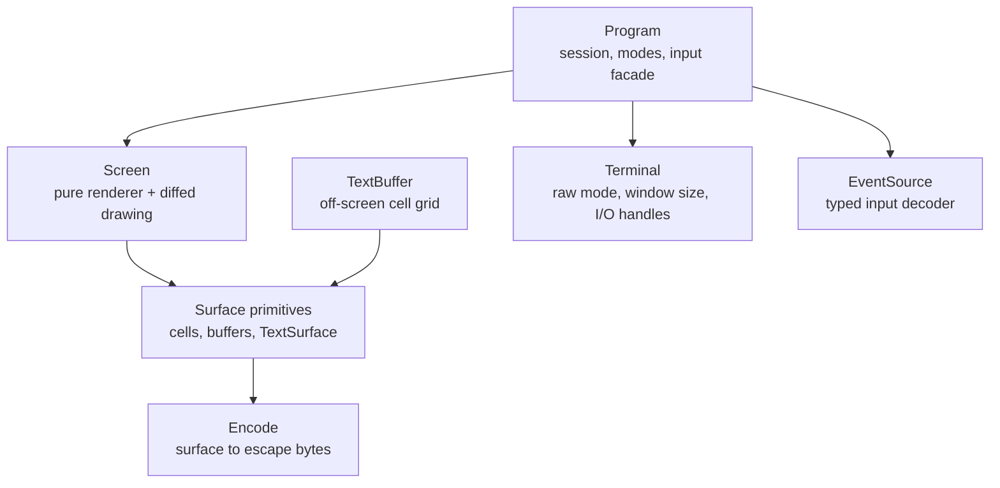

`Program` is the front door for most interactive apps. It is assembled from
smaller pieces, and each piece is usable on its own when your use case calls for
it. This page maps those roles and shows when to reach for each one.



uncurses gives you two common routes. `Program` manages an interactive terminal
session: it owns the terminal, decodes input, emits terminal modes, and exposes a
`Screen` for diffed drawing. `Screen` by itself is only the renderer: you paint a
cell grid and render it into any writer, with no input or session involved.
`TextBuffer` is for off-screen output: you paint whole frames and serialize them
to bytes yourself. `Terminal` and `EventSource` are the pieces `Program` uses for
raw-mode terminal access and input decoding, and you can use them directly when
that is the right fit.

## Program

The interactive facade. `Program` owns a `Terminal`, an `EventSource`, capability
state, and a `Screen` renderer. It is where raw mode, alternate screen, mouse,
bracketed paste, focus events, cursor visibility, queries, pause, resume, and
teardown live. Drawing is reached through `program.screen_mut()`, and `render()`
still belongs to `Screen`.

```rust
use uncurses::event::Event;
use uncurses::program::Program;
use uncurses::style::Style;
use uncurses::text::TextSurface;

fn main() -> std::io::Result<()> {
    let mut program = Program::stdio()?;
    program.init()?;
    program.enter_alt_screen()?;
    program.hide_cursor()?;

    program
        .screen_mut()
        .set_str((0, 0), "managed session, pure renderer", Style::new());
    program.screen_mut().render()?;

    while !matches!(program.read_event()?, Event::KeyPress(_)) {}

    program.finish()
}
```

Reach for `Program` to build an interactive app: anything with an event loop, a
changing display, and a terminal it should leave spotless on exit. If you are
not sure which layer you want, it is this one.

`init()` enters raw mode and applies the selected `ProgramOptions`, but it does
not probe the terminal. Capability discovery is opt-in: call
`program.query_capabilities(&[])?`, then read events until
`Event::PrimaryDeviceAttributes` arrives or your timeout expires. `read_event()`
and `try_read_event()` observe replies automatically, so a normal event loop can
collect them without a separate drain path.

## Screen

The pure cell-diff renderer. `Screen<W>` owns a desired cell grid, a diff
renderer, and a writer. It does not read input, enter raw mode, query
capabilities, or emit terminal modes. It only draws frames. Render properties
such as fullscreen, cursor visibility, grapheme clusters, synchronized output,
color profile, and optimizations are plain setters that cannot fail and write
nothing.

```rust
use uncurses::screen::Screen;
use uncurses::style::Style;
use uncurses::text::TextSurface;

fn main() -> std::io::Result<()> {
    let mut screen = Screen::new(Vec::new(), (20, 1));
    screen.set_str((0, 0), "rendered to bytes", Style::new());
    screen.render()?;

    let bytes = screen.into_writer();
    assert!(!bytes.is_empty());
    Ok(())
}
```

Reach for a bare `Screen` when you want diffed rendering into a writer you
already own, or when an output-only program should not touch terminal modes. In
an interactive app, let `Program` own the `Screen` and use
`program.enter_alt_screen()`, `program.hide_cursor()`, and the other mode
methods. Those methods emit the terminal mode and update the matching render
property together.

## TextBuffer

An off-screen frame buffer. A `TextBuffer`, or any [surface]() grid, is a structured grid of cells you paint
complete frames into and compose before sending them anywhere. It composes whole
frames rather than diffing, and owns neither input nor output, so it never
touches raw mode. When a frame is ready, the
[`Encode`](/api/uncurses/text/trait.Encode.html) trait serializes it to bytes you
write wherever you like: a terminal, a pipe, a file, or a string.

```rust
use uncurses::buffer::TextBuffer;
use uncurses::color::Profile;
use uncurses::style::Style;
use uncurses::text::{Encode, TextSurface};

fn main() {
    let mut frame = TextBuffer::new(80, 24);
    frame.set_str((0, 0), "rendered once", Style::new());

    let ansi = frame.display().to_string();
    let plain = frame.display_with(Profile::Disabled).to_string();

    assert!(ansi.contains("rendered once"));
    assert_eq!(plain.lines().next(), Some("rendered once"));
}
```

By default, encoding uses true color. To choose another color profile, the
`*_with` variants take a [color `Profile`]():
`encode_with` and `display_with` downsample to `Ansi256` or `Ansi`, or strip
styling entirely. `Profile::Ascii` keeps attributes but drops color, and
`Profile::Disabled` produces plain text with no escape sequences, which is useful
for logs, diffs, and snapshot tests.

Composing frames this way fits one-shot output, transcripts, golden tests, and
append-style printing, anywhere a live, diffed session would get in the way.

## EventSource

The input decoder. An `EventSource` reads raw bytes from an input handle and
decodes them into structured [`Event`]()
values: keypresses, mouse events, paste, focus changes, and resizes. That is its
entire job. It does not draw, render, or touch the output side at all; it turns
terminal input into types you can match on. It is exactly what `Program` uses
under the hood to read events.

```rust
use uncurses::event::{Event, EventSource};
use uncurses::terminal::Terminal;

fn main() -> std::io::Result<()> {
    let mut term = Terminal::stdio();
    term.make_raw()?;
    let mut events = EventSource::new(term.input())?;

    if let Event::KeyPress(key) = events.read()? {
        let _ = key;
    }

    term.restore()
}
```

Three ways to pull events: `read()` blocks until one arrives, `poll(timeout)`
waits until one is queued or the timeout expires, and `try_read()` returns the
next queued event without blocking. With the `async` feature, `into_stream()`
turns the source into an `EventStream`. On `Program`, these are spelled
`read_event`, `poll_event`, and `try_read_event`, with `event_stream()` for async
loops over the program's own decoder. Program event reads observe automatically;
reach for a bare `EventSource` when you need decoded terminal input on its own,
separate from the drawing and session that `Program` bundles around it.

## Terminal

The device handle. `Terminal` owns the connection to the tty: it enters and
leaves raw mode, queries the window size, carries the environment, and exposes
copyable input and output handles you can hand to the other pieces.
`make_raw()` stashes the prior state so `restore()` can put it back with no
arguments.

```rust
use uncurses::terminal::Terminal;

fn main() -> std::io::Result<()> {
    let mut term = Terminal::stdio();
    term.make_raw()?;
    let size = term.get_window_size().unwrap_or_default();
    let _ = (term.input(), term.output(), size);
    term.restore()
}
```

You rarely start here unless you are assembling your own version of `Program`,
or you need the raw device for something uncurses does not wrap. Most of the
time, `Program` holds the `Terminal` for you.

## Which layer

| You want to... | Reach for |
| --- | --- |
| Build an interactive app, inline or fullscreen | `Program` |
| Render a diffed frame into a writer you own | `Screen` |
| Produce a frame to print, log, snapshot test, or pipe | `TextBuffer` |
| Read and decode terminal input on its own | `EventSource` |
| Touch raw mode and the device, nothing more | `Terminal` |

When in doubt, start with `Program`. Move to the smaller pieces only when a
specific need points there.

## Next steps

With the map in place, the next page puts `Program` and its `Screen` renderer to
work and builds a small interactive app from an empty file: [your first app]().
