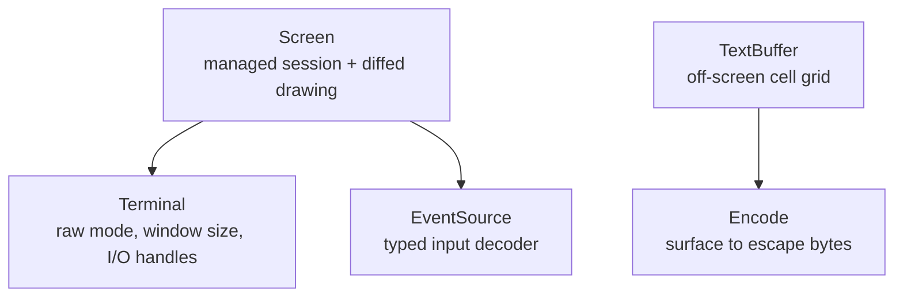

`Screen` is the front door for most apps. It is assembled from smaller pieces,
and each piece is usable on its own when your use case calls for it. This page
maps those roles and shows when to reach for each one.



uncurses gives you two common routes. `Screen` manages a terminal session: it
owns the terminal, decodes input, and diffs frames so only changed cells hit the
wire. `TextBuffer` is for off-screen output: you paint whole frames and serialize
them to bytes yourself, with no session involved. `Terminal` and
`EventSource` are the pieces `Screen` uses for raw-mode terminal access and
input decoding, and you can use them directly when that is the right fit.

## Screen

The managed terminal session and home of diffed drawing. `Screen` owns a
`Terminal` and an `EventSource`, tracks what is currently on the terminal across
frames, and emits only the cells that changed. It also handles raw mode,
capability detection, a sensible set of default modes, and teardown. Drive it
inline or fullscreen.

```rust
let mut screen = Screen::stdio()?;
screen.init()?;
screen.set_str((0, 0), "managed and diffed", Style::new());
screen.render()?;
screen.finish()
```

Reach for `Screen` to build an interactive app: anything with an event loop, a
changing display, and a terminal it should leave spotless on exit. If you are
not sure which layer you want, it is this one.

## TextBuffer

An off-screen frame buffer. A `TextBuffer`, or any [surface]() grid, is a structured grid of cells you paint
complete frames into and compose before sending them anywhere. There is no
diffing and no terminal session; it owns neither input nor output, so it never
touches raw mode. When a frame is ready, the
[`Encode`](/api/uncurses/text/trait.Encode.html) trait serializes it to bytes you
write wherever you like: a terminal, a pipe, a file, or a string.

```rust
let mut frame = TextBuffer::new(80, 24);
frame.set_str((0, 0), "rendered once", Style::new());
let bytes = frame.display().to_string();
```

By default, encoding uses true color. To choose another color profile, the
`*_with` variants take a [color `Profile`]():
`encode_with` and `display_with` downsample to `Ansi256` or `Ansi`, or strip
styling entirely. `Profile::Ascii` keeps attributes but drops color, and
`Profile::Disabled` produces plain text with no escape sequences, which is useful
for logs, diffs, and snapshot tests.

```rust
// Plain text, no ANSI escapes.
let plain = frame.display_with(Profile::Disabled).to_string();
```

Composing frames this way fits one-shot output, transcripts, golden tests, and
append-style printing, anywhere a live, diffed session would get in the way.

## EventSource

The input decoder. An `EventSource` reads raw bytes from an input handle and
decodes them into structured [`Event`]()
values: keypresses, mouse events, paste, focus changes, and resizes. That is its
entire job. It does not draw, render, or touch the output side at all; it turns
terminal input into types you can match on. It is exactly what `Screen` uses
under the hood to read events.

```rust
let mut term = Terminal::stdio();
term.make_raw()?;
let mut events = EventSource::new(term.input())?;

match events.read()? {
    Event::KeyPress(key) => { /* handle it */ }
    _ => {}
}

term.restore()
```

Three ways to pull events: `read()` blocks until one arrives, `poll(timeout)`
waits until one is queued or the timeout expires, and `try_read()` returns the
next queued event without blocking. With the `async` feature, `into_stream()`
turns the source into an `EventStream`. On `Screen`, these are spelled
`read_event`, `poll_event`, and `try_read_event`, with `event_stream()` for async
loops over the screen's own decoder. Screen event reads are pure: feeding each
one to `screen.observe_event(&ev)?` is optional and keeps capability detection,
resize handling, and discovery defaults alive, and skipping it still reads fine.
Reach for a bare `EventSource` when you need decoded terminal input on its own,
separate from the drawing and session that `Screen` bundles around it.

## Terminal

The device handle. `Terminal` owns the connection to the tty: it enters and
leaves raw mode, queries the window size, snapshots the environment, and exposes
copyable input and output handles you can hand to the other pieces.
`make_raw()` stashes the prior state so `restore()` can put it back with no
arguments.

```rust
let mut term = Terminal::stdio();
term.make_raw()?;
let size = term.get_window_size().unwrap_or_default();
// hand term.input() / term.output() to the other pieces
term.restore()
```

You rarely start here unless you are assembling your own version of `Screen`, or
you need the raw device for something uncurses does not wrap. Most of the time,
`Screen` holds the `Terminal` for you.

## Which layer

| You want to... | Reach for |
| --- | --- |
| Build an interactive app, inline or fullscreen | `Screen` |
| Produce a frame to print, log, snapshot test, or pipe | `TextBuffer` |
| Read and decode terminal input on its own | `EventSource` |
| Touch raw mode and the device, nothing more | `Terminal` |

When in doubt, start with `Screen`. Move to the smaller pieces only when a
specific need points there.

## Next steps

With the map in place, the next page puts `Screen` to work and builds a small
interactive app from an empty file: [your first app]().
