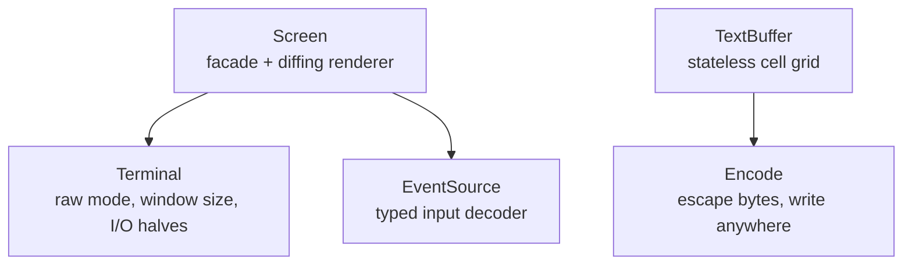

`Screen` is the front door, and most apps never need anything else. But it is
assembled from smaller pieces, and each of those pieces is usable on its own when
your use case calls for it. This page lays them out and shows where each one
fits.



There are really two routes through uncurses. The managed route is `Screen`: it
owns a terminal, decodes input, and diffs frames so only changed cells hit the
wire. The compose-it-yourself route is `TextBuffer`: you paint whole frames and
serialize them to bytes yourself, with no session and no renderer in sight. The
two lower blocks, `Terminal` and `EventSource`, are what `Screen` is assembled
from, and you can wield them directly when you want to.

## Screen

The facade and the home of the diffing renderer. `Screen` owns a
`Terminal` and an `EventSource`, tracks what is currently on the terminal across
frames, and emits only the cells that changed. It also handles raw mode,
capability detection, a sensible set of default modes, and teardown. Drive it
inline or fullscreen.

```rust
let mut screen = Screen::stdio()?;
screen.init()?;
screen.set_str((0, 0), "managed and diffed", Style::new());
screen.render()?;
screen.finish()
```

Reach for `Screen` to build an interactive app: anything with an event loop, a
changing display, and a terminal it should leave spotless on exit. If you are
not sure which layer you want, it is this one.

## TextBuffer

The compose-it-yourself route. A `TextBuffer`, or any [surface]() grid, is a structured grid of cells you paint full
frames into and compose before sending them anywhere. There is no renderer, no
diffing, and no terminal session; it owns neither input nor output, so it never
touches raw mode. When a frame is ready, the [`Encode`]() trait serializes it to bytes you write wherever you
like: a terminal, a pipe, a file, a string.

```rust
let mut frame = TextBuffer::new(80, 24);
frame.set_str((0, 0), "rendered once", Style::new());
let bytes = frame.display().to_string();
```

By default the bytes carry full-color ANSI escapes. To pin the output to a
specific level instead, the `*_with` variants take a [color `Profile`](): `encode_with` and `display_with` downsample to
`Ansi256` or `Ansi`, or strip styling entirely. `Profile::Ascii` keeps
attributes but drops color, and `Profile::Disabled` produces plain text with no
escape sequences at all, ideal for logs, diffs, and snapshot tests.

```rust
// Plain text, no ANSI escapes.
let plain = frame.display_with(Profile::Disabled).to_string();
```

Composing frames this way is the tool for one-shot output, transcripts, golden
tests, and append-style printing, anywhere a live, diffed session would only get
in the way.

## EventSource

The input decoder. An `EventSource` reads raw bytes from an input handle and
decodes them into structured [`Event`]()
values: keypresses, mouse, paste, focus, resize. That is its entire job. It does
not draw, render, or touch the output side at all; it turns terminal input into
types you can match on. It is exactly what `Screen` uses under the hood to read
events.

```rust
let mut term = Terminal::stdio();
term.make_raw()?;
let mut events = EventSource::new(term.input())?;

match events.read()? {
    Event::KeyPress(key) => { /* handle it */ }
    _ => {}
}

term.restore()
```

Three ways to pull events: `read()` blocks until one arrives, `poll(timeout)`
waits up to a deadline, and `try_read()` drains what is already queued without
blocking. (On `Screen` these are spelled `read_event`, `poll_event`, and
`try_read_event`.) Reach for a bare `EventSource` when you need decoded terminal
input on its own, separate from the renderer and session that `Screen` bundles
around it.

## Terminal

The device handle and the bottom of the stack. `Terminal` owns the connection to
the tty: it enters and leaves raw mode, queries the window size, snapshots the
environment, and splits into input and output halves you can hand to the layers
above. `make_raw()` stashes the prior state so `restore()` can put it back with
no arguments.

```rust
let mut term = Terminal::stdio();
term.make_raw()?;
let size = term.get_window_size().unwrap_or_default();
// hand term.input() / term.output() to the pieces above
term.restore()
```

You rarely start here unless you are assembling your own version of `Screen`, or
you need the raw device for something uncurses does not wrap. Most of the time,
`Screen` holds the `Terminal` for you.

## Which layer

| You want to... | Reach for |
| --- | --- |
| Build an interactive app, inline or fullscreen | `Screen` |
| Produce a frame to print, log, snapshot-test, or pipe | `TextBuffer` |
| Read and decode terminal input on its own | `EventSource` |
| Touch raw mode and the device, nothing more | `Terminal` |

When in doubt, start at the top with `Screen` and drop down only when a specific
need pushes you there.

## Next steps

Enough map. The next page puts `Screen` to work and builds a small interactive
app from an empty file: [your first app]().
