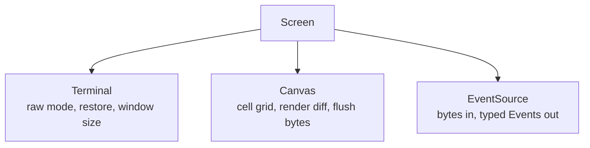
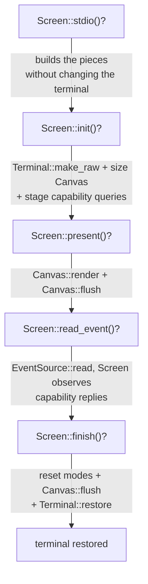

uncurses is organized as a few small layers. Use the highest layer that gives you the control you need, then drop lower when you want to own more of the lifecycle.

## The map



The lifecycle threads through all three:



## Which layer should I use?

| You want to... | Use | Why |
| --- | --- | --- |
| Build an interactive terminal app quickly | `Screen` | It owns the terminal, renderer, and input decoder, and wires up init, teardown, resize, capability detection, and mode tracking. |
| Draw cells into a terminal, byte buffer, socket, or snapshot test | `Canvas` | It is the cell grid plus diffing renderer over any `Write`, with no input or raw-mode policy. |
| Decode keyboard, mouse, paste, focus, resize, and query replies | `EventSource` | It turns bytes from an input source into typed `Event` values. |
| Enter raw mode or ask for the current window size | `Terminal` | It is the direct handle for terminal state and dimensions. |
| Emit or parse a specific escape sequence | `ansi` | It contains low-level encoders and parsers for cursor controls, modes, colors, and queries. |

## Screen

`Screen<I, O>` is the facade. It combines:

- a `Terminal<I, O>` for raw-mode lifecycle and window-size queries,
- a `Canvas<O>` for drawing and diffed output,
- an `EventSource<I>` for decoded input.

Use `Screen` for normal interactive programs. A session starts with `init()` or `init_with(...)` and ends with `finish()`. Construction is inert, `init()` enters raw mode and stages capability queries, and `finish()` restores the terminal. The default initialized screen is inline with the cursor visible; fullscreen and hidden-cursor modes are opt-in through `enter_alt_screen()` and `hide_cursor()`.

See [Hello, terminal]() for the smallest complete `Screen` program.

## Canvas

`Canvas<W>` is the drawable cell grid and renderer. It stores styled cells in memory, compares the current frame with the last rendered frame, and stages only the necessary terminal bytes. The writer can be a terminal output handle or any other `Write`, such as a `Vec<u8>` for tests.

Use `Canvas` directly when you want to manage raw mode, input, and terminal modes yourself. The `low_level` example wires a `Terminal`, `Canvas`, and `EventSource` by hand.

## EventSource

`EventSource<I>` reads raw input bytes and decodes them into `Event` values: key presses, mouse events, paste, focus changes, resize reports, and terminal query replies.

Use it directly for input-only tools, probes, or custom loops where rendering is handled elsewhere. With the `async` feature, uncurses also exposes an async event stream over `futures_core::Stream`.

## Terminal

`Terminal<I, O>` owns the input and output halves and handles the host terminal state. It can enter raw mode with `make_raw()`, restore the previous state with `restore()`, and query the window size.

Use it directly when you are building your own lifecycle instead of using `Screen`.

## Infallible draw, fallible flush

Drawing methods write into memory and return nothing:

```rust
screen.set_str((0, 0), "Hello", Style::default());
```

The I/O boundary is explicit. Bytes reach the terminal only when you flush, usually through `present()`:

```rust
screen.present()?;
```

This split keeps the hot drawing path simple while preserving honest error handling at the point where output can actually fail.

## Next steps

- Add uncurses to a project in [Installation]().
- Build a first program in [Hello, terminal]().
- Read the generated [API reference](../../../api/) for exact type and method documentation.
