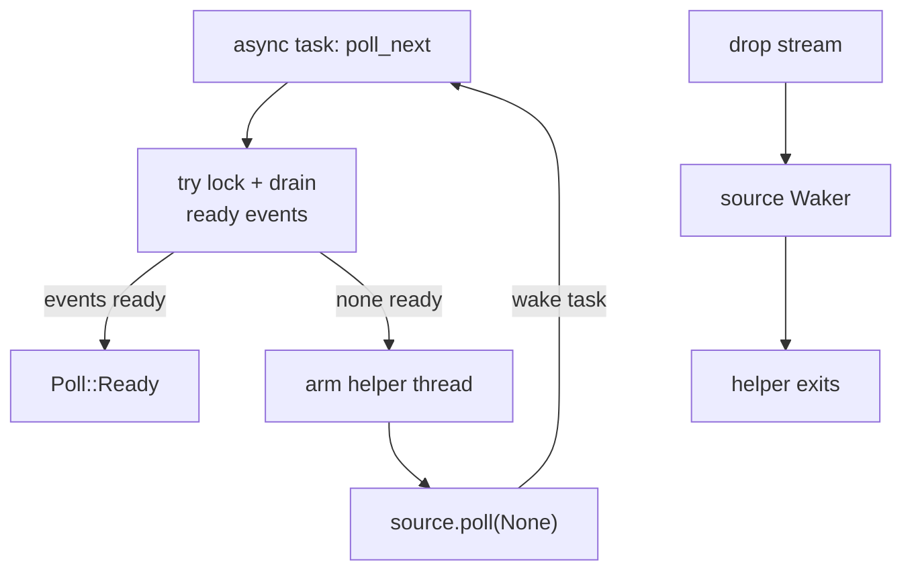

With the `async` feature, `Screen::events()` returns a `futures_core::Stream` of the same decoded events that `read_event()` would produce. Use it when your terminal UI needs to coexist with async tasks, timers, or I/O.


Run the example with `cargo run --example async_input`. The examples crate enables uncurses' `async` feature and uses `tokio_stream::StreamExt` for `.next().await`.


## How it works

The stream is runtime-agnostic. Internally, uncurses adapts its blocking event source with a helper reader thread.



`Screen::events()` creates the thread-backed stream lazily and reuses it. The temporary stream adapter borrows the screen for one `next().await`, so the loop body can draw with `screen` again.

## Walk through the example

### 1. Enable the feature and import a Stream extension

In a library or application crate, enable `uncurses`' `async` feature. The example imports `tokio_stream::StreamExt`, but any compatible `StreamExt` with `next` works.

```rust
use tokio_stream::StreamExt;
use uncurses::screen::{Screen, ScreenOptions};
```

### 2. Initialize the screen normally

`async_input.rs` uses the same setup as a synchronous fullscreen app.

```rust
#[tokio::main(flavor = "current_thread")]
async fn main() -> std::io::Result<()> {
    let mut screen = Screen::stdio()?;
    screen.init_with(ScreenOptions::default())?;
    screen.enter_alt_screen()?;
    screen.hide_cursor()?;

    let result = run(&mut screen).await;
    screen.finish()?;
    result
}
```

### 3. Await events and draw inside the loop

Call `screen.events().next().await` in the `while let` condition. Do not bind the stream outside the loop; the adapter borrows the screen.

```rust
async fn run(screen: &mut Screen<Stdin, Stdout>) -> std::io::Result<()> {
    let quit: [Key; 3] = ["q", "esc", "ctrl+c"].map(|s| s.parse().unwrap());
    let mut typed = String::new();
    render(screen, &typed);

    while let Some(event) = screen.events().next().await {
        match event? {
            Event::KeyPress(ref k) if quit.contains(k) => break,
            Event::KeyPress(Key {
                code: uncurses::event::KeyCode::Char(c),
                ..
            }) => typed.push(c),
            Event::KeyPress(Key {
                code: uncurses::event::KeyCode::Backspace,
                ..
            }) => {
                typed.pop();
            }
            Event::Resize(ws) => screen.resize((ws.col, ws.row)),
            _ => continue,
        }
        render(screen, &typed);
    }
    Ok(())
}
```

### 4. Add timeout-based termination if your runtime provides it

The uncurses stream itself yields terminal events. If you want an idle timeout, wrap one `next()` await in your runtime's timeout primitive.

```rust
use std::time::Duration;
use tokio::time::timeout;

match timeout(Duration::from_secs(30), screen.events().next()).await {
    Ok(Some(event)) => {
        let event = event?;
        // handle the event and draw
    }
    Ok(None) => return Ok(()),
    Err(_) => return Ok(()), // no event before the timeout
}
```

## Common pitfalls


Do not keep a live async stream while also reading synchronously from the same screen. Events are not broadcast; whichever consumer drains first gets them. `pause()` also drops the async stream so the next `events()` call after `resume()` recreates it.


## See also

- [The Screen facade](#reading-events)
- [Pause and resume]()
- [Examples](#mouse-and-async)
- [API reference](../api/)
