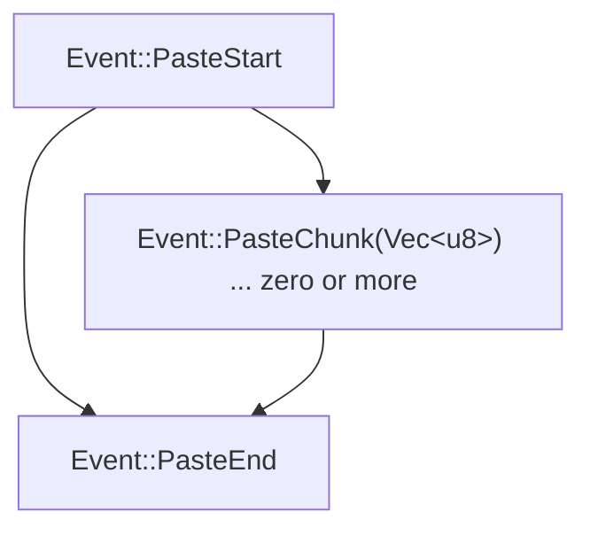

When you paste into a terminal, the bytes can look like very fast typing, which
can be unsafe: a pasted script could trigger shortcuts. Bracketed paste fixes
that by wrapping the pasted text in markers, so you can treat it as data instead
of keystrokes. uncurses turns those markers into events, and bracketed paste is
enabled by default.

## The paste events

A paste arrives as a stream: one `Event::PasteStart`, zero or more
`Event::PasteChunk` payloads, then one `Event::PasteEnd`. The chunks are raw
bytes, because a paste can be large and a chunk might not be valid UTF-8 on its
own: a multibyte character can be split across a chunk boundary.



## Collecting a paste

The common case: accumulate the chunks into a buffer, then decode once at
`PasteEnd`.

```rust
use uncurses::event::Event;

fn collect_paste(ev: Event, paste: &mut Option<Vec<u8>>) -> Option<String> {
    match ev {
        Event::PasteStart => {
            *paste = Some(Vec::new());
            None
        }
        Event::PasteChunk(bytes) => {
            paste.as_mut()?.extend_from_slice(&bytes);
            None
        }
        Event::PasteEnd => paste
            .take()
            .map(|buf| String::from_utf8_lossy(&buf).into_owned()),
        _ => None,
    }
}
```

If your loop tracks terminal capabilities, call `screen.observe_event(&ev)?`
after reading. Paste decoding does not depend on it.


Decode at the end, not per chunk: a multibyte character can be split across
`PasteChunk` events, so decoding each chunk on its own would corrupt it. Pastes
also carry their own newlines, so normalize `\r\n` and lone `\r` to `\n` if your
buffer has a line model.


## Spilling large pastes to disk

Holding a paste in memory is fine until someone pastes a megabyte of logs. For
that, feed chunks into a sink that keeps bytes in memory up to a threshold, then
opens a spill file and streams the rest straight to disk.

```rust
use std::fs::File;
use std::io::{self, Write};
use std::path::Path;

const THRESHOLD: usize = 64 * 1024;

struct PasteSink {
    mem: Vec<u8>,
    spill: Option<File>,
}

impl PasteSink {
    fn push(&mut self, chunk: &[u8], spill_path: &Path) -> io::Result<()> {
        if let Some(file) = self.spill.as_mut() {
            return file.write_all(chunk);
        }
        self.mem.extend_from_slice(chunk);
        if self.mem.len() > THRESHOLD {
            let mut file = File::create(spill_path)?;
            file.write_all(&self.mem)?;
            self.mem.clear();
            self.spill = Some(file);
        }
        Ok(())
    }
}
```

Because chunks arrive one event at a time, you make this decision incrementally
and never hold the whole paste at once. The `paste_to_file` example implements
exactly this sink and reports whether the paste stayed in memory or landed in a
file.

## Turning it on and off

Bracketed paste is enabled by default. To start without it, pass
`ScreenOptions { bracketed_paste: false, ..Default::default() }` to `init_with`.
At runtime, toggle it with `screen.enable_bracketed_paste()` and
`screen.disable_bracketed_paste()`. With it off, pasted text comes through as
ordinary key events instead.

See the `paste` and `paste_to_file` examples for the in-memory and
spill-to-disk versions.
