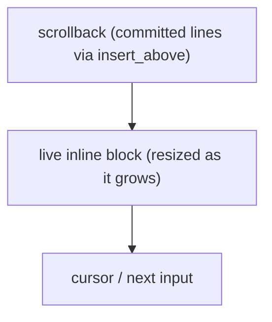

Most fullscreen apps take over the terminal with the alternate screen. Many
tools, prompts, progress bars, pickers, and REPLs want to draw a live region
right where the cursor is and leave the scrollback intact. That is inline mode,
and it is the uncurses default.

## The idea

A `Program` owns the terminal session, input, and terminal modes. Its `Screen`
is the renderer you reach with `program.screen_mut()`. After `init()`, that
screen starts inline with the cursor visible: it owns a block of rows starting at
the cursor and draws there, in the normal buffer. You decide how many rows it
owns with `resize`, and you can grow or shrink that block as your content
changes. Nothing scrolls into history unless you ask for it.

```rust
use uncurses::buffer::Bounded;
use uncurses::program::Program;
use uncurses::style::Style;
use uncurses::text::TextSurface;

fn main() -> std::io::Result<()> {
    let mut program = Program::stdio()?;
    program.init()?; // inline, cursor visible, no alternate screen

    // Claim one content row plus one trailing blank row right here at the cursor.
    let width = program.screen().width();
    let screen = program.screen_mut();
    screen.resize((width, 2));
    screen.set_str((0, 0), "working...", Style::new());
    screen.render()?;

    program.finish()
}
```

Inline mode leaves the alternate screen and the cursor as they are.
`enter_alt_screen` and `hide_cursor` are opt-in, fullscreen-style choices.

## Fullscreen is a render property

Inline versus fullscreen is the screen's `fullscreen` render property.
Inline means relative addressing in a band in the normal buffer. Fullscreen means
absolute addressing over the whole viewport, which is what you want after
switching to the alternate screen buffer.

Use `program.enter_alt_screen()` and `program.exit_alt_screen()` to switch
buffers. They emit DECSET 1049 or DECRST 1049, flush, and set the screen's
`fullscreen` property to match. Calling `program.screen_mut().set_fullscreen(..)`
directly only retargets how frames are addressed. It emits no terminal mode and
switches no buffers, so use it only when you are driving the terminal bytes
yourself.

## Growing the region

Inline regions are not fixed. Call `resize` again whenever your content changes
height, and the renderer reflows the block in place. A prompt that grows as the
user types is just a `resize` per keystroke: keep the width at
`program.screen().width()` and vary only the height.

```rust
let screen = program.screen_mut();
let width = screen.width();
screen.resize((width, lines.len() as u16));
```

The renderer keeps the block anchored in the normal buffer, so growing from two
rows to ten expands the managed area instead of taking over the whole terminal.

## Placing the caret

An inline prompt keeps the cursor visible, and you usually want it sitting on the
character the user is editing, not wherever the last cell write happened to land.
Stage it with `set_cursor_position` and every `render` parks the cursor there at
the end of the frame. Drawing and cursor coordinates are `(x, y)`, zero-based;
terminal row and column reports are one-based.

```rust
let screen = program.screen_mut();
screen.set_str((0, 0), &line, Style::new());
screen.set_cursor_position((caret_col, 0));
screen.render()?;
```

It is sticky, so set it when the caret moves and later frames keep the cursor
there on their own. Call `clear_cursor_position` to stop steering it. Visibility
stays separate: `program.show_cursor()` and `program.hide_cursor()` decide
whether the caret is drawn, while `set_cursor_position` only decides where it
rests. See
[placing the cursor]()
for the full picture.

## Committing to scrollback

Sometimes you want a line to leave the live region and become permanent history,
the way a shell prints a command's output above the next prompt. That is
`insert_above` on `Screen`: it writes content into the scrollback *above* your
inline block, then keeps drawing the block below it.

```rust
program.screen_mut().insert_above("compiled in 1.2s")?;
```

It flushes immediately and leaves your live block untouched, so the committed
line lands in scrollback and the block keeps drawing right below it.

A multiline prompt that commits its buffer on `Ctrl-D` does exactly this: render
the editable block inline, and on commit push the finished text up with
`insert_above` and clear the block for the next entry.



## Teardown

Finishing an inline session resets the modes the `Program` emitted, leaves the
last frame in place, and returns the cursor to the shell.


Reserve a trailing blank row in your block (size it one taller than your content)
so the prompt comes back on a clean line.


See the `inline_input` example for a complete multiline inline prompt with
editing, paste, and `insert_above` commits.
