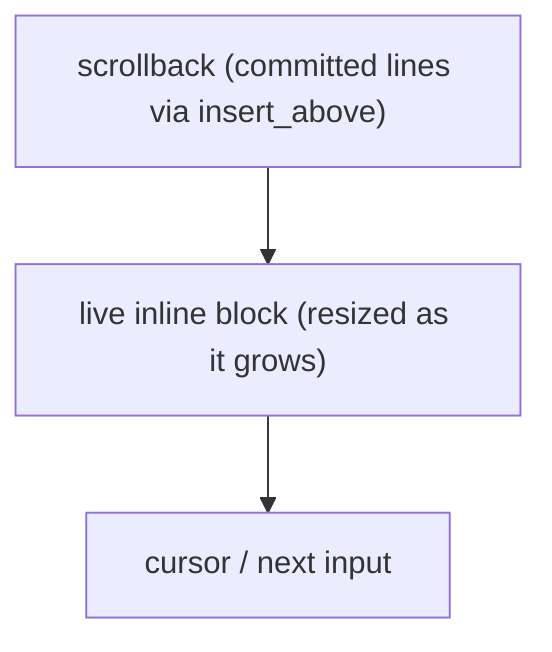

Most fullscreen apps take over the terminal with the alternate screen. Many
tools, prompts, progress bars, pickers, and REPLs want to draw a live region
right where the cursor is and leave the scrollback intact. That is inline mode,
and it is the uncurses default.

## The idea

After `init()`, a `Screen` starts inline with the cursor visible: it owns a
block of rows starting at the cursor and draws there, in the normal buffer. You
decide how many rows it owns with `resize`, and you can grow or shrink that
block as your content changes. Nothing scrolls into history unless you ask for
it.

```rust
use uncurses::buffer::Bounded;
use uncurses::screen::Screen;
use uncurses::style::Style;
use uncurses::text::TextSurface;

fn main() -> std::io::Result<()> {
    let mut screen = Screen::stdio()?;
    screen.init()?; // inline, cursor visible, no alternate screen
    screen.hide_cursor()?;

    // Claim two rows right here at the cursor.
    let w = screen.width();
    screen.resize((w, 2));

    screen.set_str((0, 0), "working...", Style::new());
    screen.render()?;

    screen.finish()
}
```

There is no `enter_alt_screen` here. That single omission is the whole
difference between an inline tool and a fullscreen one.

## Growing the region

Inline regions are not fixed. Call `resize` again whenever your content changes
height, and the renderer reflows the block in place. A prompt that grows as the
user types is just a `resize` per keystroke:

```rust
let w = screen.width();
screen.resize((w, lines.len() as u16));
```

Keep the width at `screen.width()` and vary only the height. The renderer keeps
the block anchored in the normal buffer, so growing from two rows to ten expands
the managed area instead of taking over the whole terminal.

## Committing to scrollback

Sometimes you want a line to leave the live region and become permanent history,
the way a shell prints a command's output above the next prompt. That is
`insert_above`: it writes content into the scrollback *above* your inline block,
then keeps drawing the block below it.

```rust
screen.insert_above("compiled in 1.2s")?;
```

It flushes immediately and leaves your live block untouched, so the committed
line lands in scrollback and the block keeps drawing right below it.

A multiline prompt that commits its buffer on `Ctrl-D` does exactly this: render
the editable block inline, and on commit push the finished text up with
`insert_above` and clear the block for the next entry.



## Teardown

Finishing an inline session resets terminal modes, leaves the last frame in
place, and returns the cursor to the shell.


Reserve a trailing blank row in your block (size it one taller than your content)
so the prompt comes back on a clean line.


See the `inline_input` example for a complete multiline inline prompt with
editing, paste, and `insert_above` commits.
