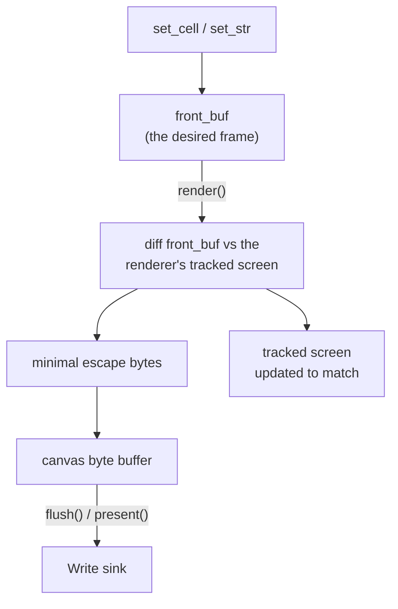

`Canvas<W>` renders to any `std::io::Write` sink. When `W` is `Vec<u8>`, the whole frame is composed off-screen: cells go in, escape bytes come out, and no terminal is touched until you choose to replay those bytes.


Run the example with `cargo run --example offscreen`.


## Walk through the example

### 1. Create a canvas over a byte buffer

`offscreen.rs` creates a fixed-size `Canvas<Vec<u8>>` and draws into it like any other canvas.

```rust
use uncurses::canvas::Canvas;

const W: u16 = 46;
const H: u16 = 9;

let mut canvas: Canvas<Vec<u8>> = Canvas::new(Vec::new(), (W, H));
draw_card(&mut canvas);
```

### 2. Render and flush into the writer

`render()` computes the diff and stages escape bytes. `flush()` drains those bytes into the underlying `Vec<u8>`. After flushing, `writer()` holds the exact bytes.

```rust
canvas.render();
canvas.flush()?;
let frame = canvas.writer().clone();
```

This is the same boundary described by the canvas docs:



### 3. Replay the exact bytes later

The example writes the already-rendered bytes to stdout. The frame is inline because no alternate screen was entered.

```rust
let mut out = io::stdout().lock();
writeln!(out, "Replaying those exact bytes on your terminal:
")?;
out.write_all(&frame)?;
writeln!(out, "
")?;
out.flush()?;
```

### 4. Use cells for snapshots or transcripts

The same canvas still has its cell grid. `offscreen.rs` reads it back as plain text after replaying the escape bytes.

```rust
for y in 0..canvas.height() {
    let mut line = String::new();
    for x in 0..canvas.width() {
        line.push_str(canvas.cell(Position::new(x, y)).map_or(" ", Cell::content));
    }
    writeln!(out, "{}", line.trim_end())?;
}
```

Use this pattern for snapshot tests, terminal transcripts, or sending rendered frames over a socket.

## Optimizations

`Canvas::new` detects renderer `Optimizations` from the process environment. If off-screen bytes must target a different terminal profile, construct from an explicit environment or set optimizations yourself with `with_optimizations` / `use_optimizations` before rendering.

## Common pitfalls


`render()` alone only stages bytes inside the canvas. Call `flush()` or `present()` before reading `writer()` if you need the rendered escape stream.


## See also

- [Canvas and rendering]()
- [Examples](#draw-only)
- [API reference](../api/)
