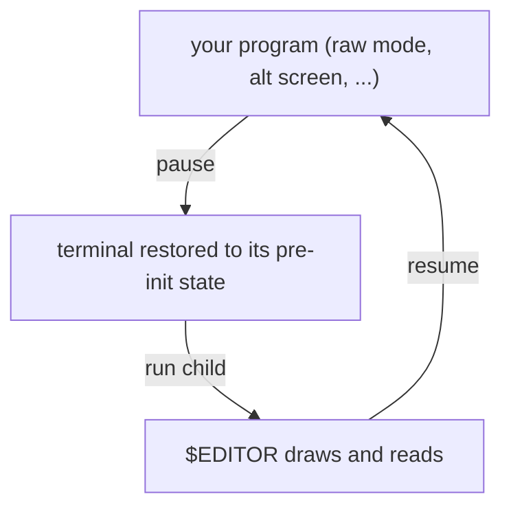

Sometimes your app needs to step aside and give the terminal back: to drop the
user into `$EDITOR`, run a shell command that draws its own output, or handle a
`Ctrl-Z` suspend. `Program::pause` and `Program::resume` bracket that handoff and
bring your screen back afterward.

## Shelling out to a child

`pause` tears down the modes the `Program` emitted and restores the terminal to
the state it had before your app took over, without dropping the renderer. Run
your child process with inherited stdio, then call `resume` to re-enter raw mode,
re-apply those modes, and refit to the current window size. After that, draw and
render a fresh frame through `program.screen_mut()`.

```rust
use std::io::Write;
use std::process::Command;

use uncurses::buffer::SurfaceMut;
use uncurses::program::Program;
use uncurses::screen::Screen;
use uncurses::terminal::{Stdin, Stdout};

fn edit(program: &mut Program<Stdin, Stdout>, path: &str) -> std::io::Result<()> {
    let editor = std::env::var("EDITOR").unwrap_or_else(|_| "vi".into());

    program.pause()?; // release the terminal in its pre-init state

    Command::new(editor)
        .arg(path)
        .status()?; // child owns the terminal here

    program.resume()?; // re-enter raw mode and refit; next render repaints

    redraw(program.screen_mut()); // you lay out the new frame...
    program.screen_mut().render() // ...and paint it; resume does not redraw for you
}

fn redraw<W: Write>(screen: &mut Screen<W>) {
    screen.clear();
}

fn main() -> std::io::Result<()> {
    let mut program = Program::stdio()?;
    program.init()?;
    edit(&mut program, "Cargo.toml")?;
    program.finish()
}
```

While paused, the child has the terminal to itself: uncurses restores the saved
pre-init state, so the child can draw and read normally while your `Program` and
its `Screen` stay alive. `resume` restores raw mode, re-applies the modes the
program emitted (alternate screen, hidden cursor, mouse, and so on), refits the
managed area to the current window, and marks the next `render` as a full
repaint.


`resume` does not redraw the previous frame for you. The window may have been
resized while you were away, which would make the old frame wrong to replay, so
uncurses leaves the drawing to you: lay out a fresh frame and call `render` after
resuming. It also does not clear whatever the child left on screen. In inline
mode, anything drawn above your surface stays put, so clear it yourself if you
need a clean slate.




## What is restored

`Program` tracks the terminal modes it emitted, separately from the screen's
render properties. `pause` and `finish` tear down exactly those emitted modes.
`resume` re-applies them. That means `program.enter_alt_screen()`,
`program.hide_cursor()`, `program.enable_mouse(..)`, and the other mode methods
round trip through pause and resume.

A render property changed directly through `program.screen_mut()` is different.
For example, `program.screen_mut().set_fullscreen(true)` only changes how future
frames are addressed. It emits nothing, so `pause` has no terminal mode to tear
down and `resume` has nothing to re-apply. Prefer the `Program` mode methods when
you want both halves kept in sync.

## Handling Ctrl-Z

On Unix, `suspend` handles the suspend key: it pauses the program, then stops the
process with `SIGTSTP`. The shell's job control takes over, holds your app as a
stopped job, and reclaims the terminal. When the user runs `fg`, `suspend`
returns and you call `resume`.

```rust
use uncurses::program::Program;
use uncurses::terminal::{Stdin, Stdout};

#[cfg(unix)]
fn handle_ctrl_z(program: &mut Program<Stdin, Stdout>) -> std::io::Result<()> {
    program.suspend()?; // pause + SIGTSTP; returns when foregrounded
    program.resume()?;  // re-acquire the terminal
    Ok(())
}

fn main() -> std::io::Result<()> {
    let mut program = Program::stdio()?;
    program.init()?;
    #[cfg(unix)]
    handle_ctrl_z(&mut program)?;
    program.finish()
}
```

Raw mode turns off the terminal's signal keys, so `Ctrl-Z` no longer suspends
your app on its own; it just arrives as a key event. `suspend` opts into that
stop, restoring the terminal before it stops the process so the shell never
inherits raw mode.

## Input note


If you drive input through the [async stream](),
you can keep the `EventStream` live across `pause`, `resume`, and `finish`; you
do not have to drop and rebuild it. Program reads auto-observe events, so
capability and size tracking update as replies and resize reports are read. If
you consume an event from somewhere else, pass it to `program.observe_event(&ev)?`
to apply the same tracking. The ratatui backend follows the same rule. Events go
to whichever consumer drains first, so avoid polling app input while the child
program owns the terminal.


See the `screen_toggle` example for a live inline/alt-screen toggle that also
suspends and resumes on `Ctrl-Z`.
