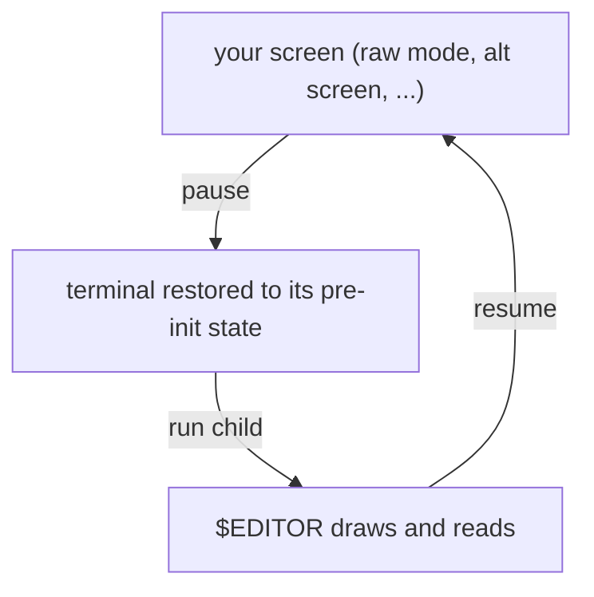

Sometimes your app needs to step aside and give the terminal back: to drop the
user into `$EDITOR`, run a shell command that draws its own output, or handle a
`Ctrl-Z` suspend. `pause` and `resume` bracket that handoff and bring your screen
back afterward.

## Shelling out to a child

`pause` tears down your modes and restores the terminal to the state it had
before your app took over, without consuming the screen. Run your child process
with inherited stdio, then `resume` to re-enter raw mode, refit to the current
window size, and repaint.

```rust
use std::process::Command;

fn edit(screen: &mut Screen<Stdin, Stdout>, path: &str) -> std::io::Result<()> {
    let editor = std::env::var("EDITOR").unwrap_or_else(|_| "vi".into());

    screen.pause()?; // release the terminal in its pre-init state

    Command::new(editor)
        .arg(path)
        .status()?; // child owns the terminal here

    screen.resume()?; // re-enter raw mode and refit; arms a full repaint

    redraw(screen); // you lay out the new frame...
    screen.render() // ...and paint it; resume does not redraw for you
}
```

While paused, the child has the terminal to itself: uncurses hands it back in the
same state it had before your app initialized, so the child draws and reads as it
likes while your screen's state waits untouched. `resume` restores raw mode,
re-applies your staged modes (alternate screen, hidden cursor, mouse, and so on),
refits the managed area to the current window, and arms a full clear-and-repaint
for your next `render`.


`resume` does not redraw the previous frame for you. The window may have been
resized while you were away, which would make the old frame wrong to replay, so
uncurses leaves the drawing to you: lay out a fresh frame and call `render` after
resuming. It also does not clear whatever the child left on screen, in inline
mode anything drawn above your surface stays put, so clear it yourself if you
need a clean slate.




## Handling Ctrl-Z

On Unix, `suspend` is the suspend-key version: it pauses the screen, then stops
the process with `SIGTSTP`. The shell's job control takes over, backgrounds your
app, and reclaims the terminal. When the user runs `fg`, `suspend` returns and
you `resume`.

```rust
// in your event loop, on Ctrl-Z:
#[cfg(unix)]
{
    screen.suspend()?; // pause + SIGTSTP; returns when foregrounded
    screen.resume()?;  // re-acquire the terminal
}
```

Raw mode turns off the terminal's signal keys, so `Ctrl-Z` no longer suspends
your app on its own; it just arrives as a key event. `suspend` opts back into
the suspend, restoring the terminal before it stops the process so the shell
never inherits raw mode.

## Async note

If you are driving input through the [async stream](), `pause` stops the stream's reader thread first so it does not fight the
child for input. The next `events()` after `resume` starts a fresh stream.

See the `screen_toggle` example for a live inline/alt-screen toggle that also
suspends and resumes on `Ctrl-Z`.
