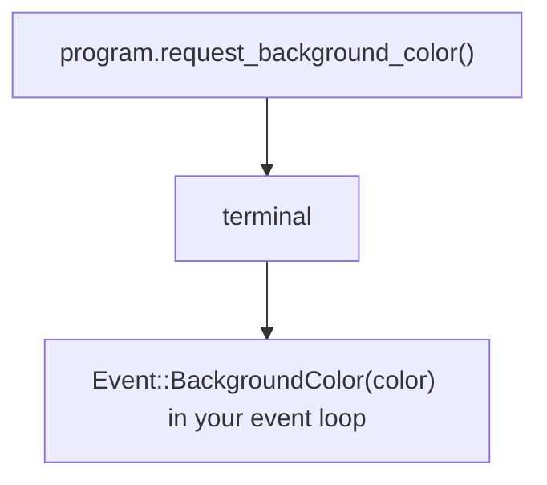

Terminals can answer questions about themselves: the background color, the pixel
size of a cell, the current cursor position, and what features they support.
uncurses models this as a request you send and a reply that comes back as an
ordinary event.

## The request and reply model

You write a request, the terminal writes an answer, and that answer arrives in
the same event stream as keystrokes. There is no separate "query" channel.




Startup is quiet. `Program::init()` and `Program::init_with()` set up the
session and leave the terminal alone, so every query is a call you make.


## Capability probing

Call `program.query_capabilities(&extra_bytes)?` when you want uncurses to ask
for its standard capability set. It writes the default queries, then your extra
bytes, then Primary Device Attributes last, and flushes. The Primary DA reply is
the sentinel: because its request was sent last, seeing
`Event::PrimaryDeviceAttributes` means every earlier reply in that batch has
already been delivered.

`query_capabilities` only writes. Consuming the replies is your job, so bound the
wait with `poll_event(Some(timeout))`. A silent terminal never answers, including
the sentinel.

Reading those replies is not purely passive. A few of them are adopted as they
pass through: synchronized output always, and grapheme-cluster mode and in-band
resize when `ProgramOptions::prefer_grapheme_clusters` and
`prefer_in_band_resize` are left at their `true` default. Adoption emits the
mode, so it is recorded in the program's emitted-mode set and undone by
`finish()`. Set either field to `false` to record the capability without
enabling it.

```rust
use std::time::{Duration, Instant};

use uncurses::event::Event;
use uncurses::program::Program;

fn main() -> std::io::Result<()> {
    let mut program = Program::stdio()?;
    program.init()?;
    program.query_capabilities(&[])?;

    let deadline = Instant::now() + Duration::from_millis(300);
    while let Some(timeout) = deadline.checked_duration_since(Instant::now()) {
        if !program.poll_event(Some(timeout))? {
            break;
        }
        if matches!(program.try_read_event()?, Some(Event::PrimaryDeviceAttributes(_))) {
            break;
        }
    }

    let _caps = program.capabilities();
    program.finish()
}
```

Reads on `Program` auto-observe, so the loop above updates `capabilities()` as it
reads replies. An ordinary event loop gets the same benefit for free: if it keeps
calling `read_event`, `try_read_event`, or `poll_event` plus a read, capability
replies are applied as they arrive.

That covers every reply describing the terminal, not only the ones
`query_capabilities` asks for. A `request_background_color` answered mid-session
is recorded just the same, so you can read it back from `capabilities()` later
instead of matching the event and storing it yourself. Sizes are the exception:
window and cell geometry lives on `Program` as `window_cells()`,
`window_pixels()`, and `cell_pixels()`, since it changes with every resize.

## Asking one question

`Program` also has `request_*` methods for common queries. Each one sends the
request and flushes; the reply shows up later as an `Event` you match on in your
loop.

```rust
use std::time::{Duration, Instant};

use uncurses::event::Event;
use uncurses::program::Program;

fn main() -> std::io::Result<()> {
    let mut program = Program::stdio()?;
    program.init()?;
    program.request_background_color()?;

    let deadline = Instant::now() + Duration::from_millis(300);
    'wait: while let Some(timeout) = deadline.checked_duration_since(Instant::now()) {
        if !program.poll_event(Some(timeout))? {
            break;
        }
        while let Some(ev) = program.try_read_event()? {
            if let Event::BackgroundColor(color) = ev {
                let _ = color;
                break 'wait;
            }
        }
    }

    program.finish()
}
```

These cover the everyday questions: the foreground, background, cursor, and
palette colors; the cell and window pixel size; the cursor position; the color
scheme (dark or light); mode state; clipboard contents; and feature probes like
kitty keyboard and modify-other-keys. For the complete set, scan the `request_*`
methods on [`Program`](/api/uncurses/program/struct.Program.html) in the API
reference; each one documents the exact `Event` variant used for its reply.

## Extra queries in the capability batch

If you want your own query to share the Primary DA sentinel, pass its bytes as
`extra`. uncurses writes them after the default capability queries and before the
sentinel, so the same drain loop covers both the built-in replies and yours.

```rust
use std::time::{Duration, Instant};

use uncurses::ansi::color::REQUEST_BACKGROUND_COLOR;
use uncurses::event::Event;
use uncurses::program::Program;

fn main() -> std::io::Result<()> {
    let mut program = Program::stdio()?;
    program.init()?;
    program.query_capabilities(REQUEST_BACKGROUND_COLOR)?;

    let deadline = Instant::now() + Duration::from_millis(300);
    'wait: while let Some(timeout) = deadline.checked_duration_since(Instant::now()) {
        if !program.poll_event(Some(timeout))? {
            break;
        }
        while let Some(ev) = program.try_read_event()? {
            match ev {
                Event::PrimaryDeviceAttributes(_) => break 'wait,
                _ => {}
            }
        }
    }

    // Recorded on the way through, so there is nothing to match on.
    let _bg = program.capabilities().background_color();
    program.finish()
}
```

## Asking without a Program

Without `Program`, a request is just bytes you write to the terminal, and the
reply comes back through an `EventSource`. The
[`ansi`](/api/uncurses/ansi/index.html) module has named constants for common
requests, but any escape you write works the same way. Send Primary DA last if
you want a terminator, and use a deadline for terminals that do not answer.

The `query` example (`cargo run --example query`) shows this raw-byte pattern.
The `gradient` example shows the usual app pattern: call
`program.query_capabilities(&[])?`, keep reading events in the normal loop, and
let Program's auto-observation update capabilities as replies arrive.
