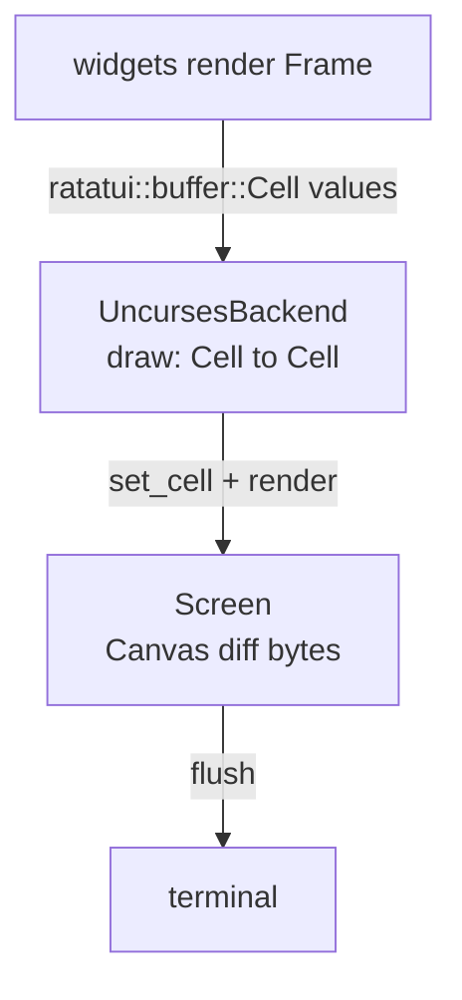

The `uncurses-ratatui` crate implements a ratatui backend on top of `uncurses::screen::Screen`. ratatui renders widgets into a frame buffer; the backend converts each cell into an uncurses cell, lets the canvas diff it, and flushes through the same screen that reads input.


Run `cargo run --example ratatui_hello` for the fullscreen path and `cargo run --example ratatui_inline` for an inline viewport.


## Rendering path



## Walk through the examples

### 1. Start with `try_init()`

`try_init()` returns a ready `ratatui::Terminal<UncursesBackend<Stdin, Stdout>>`. It initializes the wrapped `Screen`, enters the alternate screen, hides the cursor, and uses `Viewport::Fullscreen`.

```rust
fn main() -> io::Result<()> {
    let mut terminal = uncurses_ratatui::try_init()?;
    let result = run(&mut terminal);
    uncurses_ratatui::restore(&mut terminal);
    result
}
```

There are also panicking convenience wrappers, `init()` and `init_with_options()`, plus fallible `try_init_with_options()` and `try_restore()`.

### 2. Draw inside the event loop

`ratatui_hello.rs` draws every iteration. The backend checks the current terminal size during drawing, invalidates on size changes, and resizes the wrapped screen as needed.

```rust
while Instant::now() < deadline {
    terminal.draw(|f| {
        let block = Block::default()
            .title(" uncurses-ratatui ")
            .borders(Borders::ALL)
            .border_style(Style::default().fg(Color::Cyan));
        let para = Paragraph::new(
            "Hello from a ratatui app rendered through uncurses.

Press any key to exit.",
        )
        .alignment(Alignment::Center)
        .block(block);
        f.render_widget(para, f.area());
    })?;

    let events = terminal.backend_mut();
    if events.poll_event(Some(Duration::from_millis(100)))?
        && let Some(Event::KeyPress(_)) = events.try_read_event()
    {
        break;
    }
}
```

### 3. Read input through `backend_mut()`

`UncursesBackend` exposes synchronous input methods that delegate to the wrapped screen:

```rust
let backend = terminal.backend_mut();

if backend.poll_event(Some(Duration::from_millis(100)))? {
    if let Some(event) = backend.try_read_event() {
        // handle Event
    }
}

let event = backend.read_event()?;
```

The backend also exposes `get_cursor_position()` through ratatui's `Backend` trait for inline viewport anchoring.

### 4. Choose a viewport

`try_init_with_options(TerminalOptions, ScreenOptions)` passes ratatui viewport settings and uncurses screen settings together. Fullscreen and fixed viewports enter the alternate screen. Inline stays in the normal buffer at the cursor and resizes the screen buffer to the inline height.

```rust
use ratatui::{TerminalOptions, Viewport};

const INLINE_HEIGHT: u16 = 3;

let mut terminal = uncurses_ratatui::try_init_with_options(
    TerminalOptions {
        viewport: Viewport::Inline(INLINE_HEIGHT),
    },
    uncurses_ratatui::ScreenOptions::default(),
)?;
```

`ratatui_inline.rs` then draws normally; the backend translates ratatui's absolute frame rows into the inline canvas region.

```rust
terminal.draw(|frame| {
    let area = frame.area();
    let block = Block::default().title(" inline ").borders(Borders::ALL);
    frame.render_widget(
        Paragraph::new("Inline viewport — press any key to exit.").block(block),
        area,
    );
})?;
```

### 5. Use async events through the wrapped screen

With the `uncurses-ratatui` `async` feature enabled, borrow the screen from the backend and use `Screen::events()`.

```rust
use tokio_stream::StreamExt;

while let Some(event) = terminal.backend_mut().screen_mut().events().next().await {
    let event = event?;
    // handle event, then draw with terminal.draw(...)
}
```

## Common pitfalls


Always restore through `uncurses_ratatui::restore` or `try_restore` after setup helpers. Do not separately tear down individual screen modes. For inline viewports, use `Viewport::Inline(height)`; calling `enter_alt_screen()` would turn it into fullscreen-style output.


## See also

- [Inline rendering]()
- [Async events]()
- [Examples](#ratatui-backend)
- [API reference](/api/)
